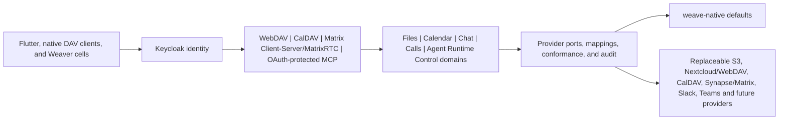

# Weave

Weave is an open-standards gateway and product surface, not a branded skin over one provider. The northbound side exposes stable Weave-owned protocols and product APIs to clients. The southbound side adapts replaceable providers behind canonical Weave domains.

## Bootstrap foundation

The bootstrap foundation is the provider-neutral architectural baseline that every deployment starts from: permanent northbound WebDAV, CalDAV and Matrix Client-Server contracts; canonical Files, Calendar and Chat domains; replaceable southbound Provider Adapters; and Infrastructure Ports that isolate concrete storage/protocol/persistence technologies such as OpenDAL, iCal4j, Ruma/JNI and JPA/PostgreSQL. Bootstrap code may select `weave-native` as the default provider, but it must not collapse canonical domain contracts into provider- or backend-specific APIs.

The binding setup boundary is documented in [`docs/bootstrap-foundation-contract.md`](docs/bootstrap-foundation-contract.md).

| Domain | Permanent northbound member data plane | Canonical Weave boundary | Selected default provider |
| --- | --- | --- | --- |
| Chat | Matrix Client-Server-compatible facade at the public API origin under `/_matrix/client/**` | Provider-neutral conversations, rooms, events, membership, sync and encryption policy | `weave-native` Chat with PostgreSQL/JPA; Synapse/Matrix-backed adapters remain optional southbound providers |
| Files | WebDAV facade under `/dav/files/**` | Provider-neutral files, folders, versions, rights, locks, lifecycle and audit | `weave-native` Files with JPA metadata and Apache OpenDAL filesystem storage; S3 and Nextcloud/WebDAV remain separate optional providers |
| Calendar | CalDAV/iCalendar facade under `/caldav/**` | Provider-neutral calendars/events, time semantics, recurrence, sync and meeting-thread references | `weave-native` Calendar with JPA/PostgreSQL and iCal4j; Nextcloud/CalDAV/Radicale adapters remain optional providers |
| Platform identity/security | OIDC/OAuth2 with Keycloak as authority | One login, user profile, roles, policy, audit, workload identities, support-safe diagnostics | Keycloak; Entra ID/Auth0/Authentik/LDAP/AD may federate or broker upstream through Keycloak |
| Boards/tasks | Weave product/control APIs while protocol parity matures | Provider-neutral task, board, readiness, mapping, authorization, and audit contracts | Local workspace today; OpenProject-class adapters remain gated |
| Calls/meetings | Matrix v1.19 plus the revision-pinned MatrixRTC Profile 0 target | Matrix room, slot, membership, authorization, media-key, consent, and artifact contracts | LiveKit is the first replaceable RTC transport/SFU, not the member contract |
| Agent Runtime Control | Signed RuntimeProfile v2 and an administrative lifecycle API | Entitlement, cell identity, desired state, profile issuance, workload reconciliation, encrypted external state, and audit | `weave/server`; Weaver/OpenClaw is the first runtime consumer |
| Agent tools | Guarded OAuth-protected MCP at `/mcp` using Spring AI stateful Streamable HTTP | ARC-bound workload admission plus `files.search` and `weave://files/{canonicalFileId}` over the canonical Files boundary | Keycloak Standard Token Exchange V2 and the existing Weave WebDAV projection; Calendar, Chat and write catalogs remain gated |

The WebDAV, CalDAV and Matrix Client-Server surfaces are server contracts, not provider feature flags. Provider selection happens only behind `FilesProviderPort`, `CalendarProviderPort`, and `ChatProviderPort`; changing a provider must not change the northbound URL, canonical IDs, authorization semantics, or application contracts.

Weave distinguishes **provider portability** from **technology access**. Provider Ports and Provider Adapters choose which implementation supplies a canonical domain capability. Infrastructure Ports and Infrastructure Adapters hide storage/protocol/persistence technology below that provider or facade. OpenDAL, iCal4j and Ruma therefore do not represent providers: OpenDAL is a storage infrastructure library, iCal4j is an iCalendar/recurrence infrastructure library, and Ruma/jni-rs form the Matrix protocol infrastructure adapter. The complete terminology is defined in `docs/architecture/provider-and-infrastructure-boundaries.md`.

This distinction also means a technology may be reused by multiple providers without collapsing their identities. `weave-native` Files uses OpenDAL's filesystem service behind `BlobStorePort`; an independently selectable S3 Files provider may also use OpenDAL's S3 service internally while remaining a separate `FilesProviderPort` implementation with separate configuration, capabilities and qualification.

Spring Boot is the server gatekeeper for OIDC, authorization, audit, readiness, and support-safe errors. The Matrix facade shares the public API origin; a `matrix.<tenant>` host is a southbound provider/operator endpoint, never a member-client setting. Server-side Matrix protocol shaping lives in the isolated `weave-matrix-protocol` Rust crate using Ruma and jni-rs. Client-side Matrix SDK/E2EE and Flutter bindings live separately in `weave-matrix-client`; client crypto is not linked into the server runtime.

Matrix encryption is device-owned. The Flutter bridge uses the Apache-2.0 Matrix Rust SDK for encrypted-room state, cross-signing, SAS verification, recovery, and an encrypted SQLite crypto store. Spring and southbound adapters may persist public device keys, opaque encrypted events, to-device envelopes, and room-key backup ciphertext, but never user private keys or decrypted message bodies. Plaintext fallback is rejected for encrypted rooms.

Textual equivalent: clients authenticate through the Weave identity boundary and always reach Weave-owned northbound standards interfaces. Those interfaces call canonical domain/application services, which select a provider only behind the corresponding Provider Port. `weave-native` is the selected default Provider Adapter for Files, Calendar and Chat; optional external providers stay southbound and replaceable. Provider Adapters may in turn compose narrower Infrastructure Ports. For Files, `BlobStorePort` is the storage Infrastructure Port and OpenDAL is an implementation technology below it; for Calendar, `IcalendarCodec`/`RecurrenceEngine` hide iCal4j; for Matrix, `MatrixProtocolCodec` hides Ruma/JNI.

Provider switching happens below the canonical domain boundary. Adapters translate provider identifiers, errors, and capabilities into Weave values; durable mappings and conformance reports preserve continuity. A provider URL, token, SDK type, Matrix homeserver, storage backend, or Nextcloud endpoint is therefore an implementation detail, never the member contract.

## Enterprise Workflow

1. **Buyer and transformation lead** align the collaboration domains that matter: identity, chat, files, calendar, boards/tasks, meetings, decisions, and governed assistance.
2. **Admin and operator** prepare the organization through one control path: connect provider categories, review readiness, preview policy impact, and keep diagnostics and evidence support-safe before member go-live.
