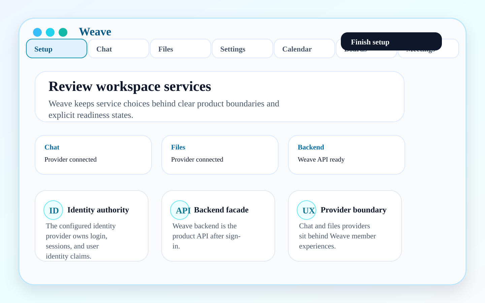

# Weave

<p align="center">
  
</p>

<p align="center">
  <a href="https://github.com/masssi164/weave/actions/workflows/ci.yml"></a>
  <a href="https://github.com/masssi164/weave/actions/workflows/live-stack-e2e.yml"></a>
</p>

Weave is an accessibility-first collaboration client for teams that want modern work tools without giving up data sovereignty. It brings chat, files, identity, and workspace settings into one Flutter app backed by self-hosted services such as Matrix, Nextcloud, Keycloak, and the Weave backend.

The goal is simple: give teams and organizations a humane migration path away from closed team suites while keeping the product experience cohesive, professional, and understandable for admins and end users.

## Why Weave

- **Accessibility built into the core** — critical flows are designed around large touch targets, semantic labels, keyboard/screen-reader behavior, and clear error states. Formal accessibility claims should stay tied to documented audits and evidence.
- **Data-sovereign collaboration** — Matrix and Nextcloud provide open protocol/data foundations behind a Weave-owned user experience.
- **One product, not separate islands** — sign-in, profile, navigation, diagnostics, chat, files, and settings are designed to feel like one workspace.
- **Migration-friendly** — Slack and Microsoft Teams interop are planned as controlled backend-owned migration and bridge paths, not as client-side shortcuts.
- **Built for future personal agents** — the long-term direction includes Weaver PA: an OpenClaw-style per-user agent runtime with organization-governed skills, connectors, and group-chat agents. This is future scope, not part of Release 1.

## Release 1 scope

Release 1 is intentionally narrow and honest. The current user-facing app shell presents:

- **Chat** — a custom Weave Matrix client surface for workspace communication.
- **Files** — a Weave files experience backed by the product backend and Nextcloud/WebDAV/OCS contracts.
- **Settings and OIDC sign-in** — setup, authentication, stored server configuration, and account/session controls.

Calendar, tasks/boards, Slack/Teams interop, migration tooling, connector SDKs, and Weaver PA are future product areas unless a feature is explicitly marked as enabled. Calendar and exploratory Deck/boards code may exist in the repository while those surfaces are under construction, but they are not Release 1 promises. The future tasks/boards direction is a Weave-owned accessible model with provider adapters, not a product dependency on Nextcloud Deck.

## Product screenshots

The images below are deterministic Release 1 marketing screenshots generated from `tool/generate_marketing_screenshots.py`. They are checked into `docs/assets/marketing/` so the README is useful without downloading CI artifacts, and each image has descriptive alt text rather than relying on image-only documentation.

### Setup


### Endpoint review



### Chat


### Files


### Settings


## Product architecture

Weave is the Flutter client in a three-repository product system:

| Repository | Owns |
| --- | --- |
| [`weave`](https://github.com/masssi164/weave) | Flutter mobile/desktop client, app shell, custom chat/files/settings UX, accessibility, and client-side tests. |
| [`weave-backend`](https://github.com/masssi164/weave-backend) | Spring Boot product API/BFF, auth validation, profile facade, files/calendar facades, readiness, and backend contracts. |
| [`weave-infra`](https://github.com/masssi164/weave-infra) | Local/dev stack, Caddy routing, Keycloak, Matrix/Synapse/MAS, Nextcloud, Terraform, Docker orchestration, smoke/E2E environment. |
| `specs/` (workspace sibling) | Binding cross-repo product and architecture contracts when this repository is checked out in the full workspace. |

The Weave product should feel like one collaboration platform even though sovereign modules sit behind it:

- **Keycloak** is the identity authority.
- **Weave backend** is the product-facing API/BFF after sign-in.
- **Matrix** provides chat protocol and storage.
- **Nextcloud** provides files and future calendar data foundations.
- **Caddy** exposes the local/dev HTTPS gateway.

For the detailed Flutter architecture, see [docs/architecture.md](docs/architecture.md). For the post-Release-1 interop direction, see [docs/interop-gateway-and-external-collaboration.md](docs/interop-gateway-and-external-collaboration.md). For future boards/tasks provider research, see [docs/research/boards-task-module-provider-strategy.md](docs/research/boards-task-module-provider-strategy.md).

## Current client foundation

The app starts through an explicit bootstrap phase before the router is built. Startup resolves into one of:

- `loading`
- `needsSetup`
- `needsSignIn`
- `ready`
- `error`

Setup and Settings share one persisted server configuration model:

- OIDC provider type
- OIDC issuer URL
- infra-managed OIDC app client ID, defaulting to `weave-app`
- Matrix homeserver URL
- Nextcloud/files base URL
- backend API base URL

App OIDC redirect handling is aligned to the infrastructure contract:

- sign-in redirect URI: `com.massimotter.weave:/oauthredirect`
- logout redirect URI: `com.massimotter.weave:/logout`

For local development stacks, Weave accepts `http://` issuer and service URLs in addition to `https://`.

Default local/dev surfaces are:

| Surface | URL |
| --- | --- |
| Product shell/admin entry | `https://weave.local` |
| Backend API/BFF | `https://api.weave.local/api` |
| Auth | `https://auth.weave.local` |
| Matrix | `https://matrix.weave.local` |
| Raw Nextcloud/admin/protocol fallback | `https://files.weave.local` |

## Code layout

Weave follows a feature-first clean architecture layout:

```text
lib/
├── core/
│   ├── bootstrap/    # App start resolution before routing
│   ├── failures/     # Shared app-level error model
│   ├── persistence/  # Secure/non-secure storage boundaries
│   ├── router/       # go_router setup and route constants
│   ├── theme/
│   └── widgets/
├── integrations/     # Shared external-service/platform boundaries
└── features/
    ├── auth/
    ├── chat/
    ├── files/
    ├── onboarding/
    ├── server_config/
    └── settings/
```

Inside each feature:

- `presentation/` contains screens, widgets, and Riverpod UI state.
- `domain/` contains entities and repository contracts.
- `data/` contains repository implementations, persistence adapters, DTOs, and protocol/service clients.

Shared integrations use the same layering under `lib/integrations/<integration>/` when multiple features need the same protocol or platform boundary.

## Accessibility baseline

Accessibility is a release requirement, not polish:

- interactive targets must be at least `48x48` logical pixels;
- icon-only actions must expose semantics labels;
- complex layouts must keep a predictable reading order;
- setup, sign-in, shell navigation, chat, files, settings, and error states must remain screen-reader friendly;
- user-facing failures should be plain-language and actionable.

## Development

### Prerequisites

- [Flutter SDK](https://docs.flutter.dev/get-started/install)
- A local Weave stack from [`weave-infra`](https://github.com/masssi164/weave-infra) for live integration and E2E tests

### Run locally

```sh
flutter pub get
flutter run
```

### Lightweight validation

```sh
flutter pub get
flutter gen-l10n
dart run build_runner build --delete-conflicting-outputs
dart format --output=none --set-exit-if-changed .
flutter analyze --fatal-infos
flutter test
make offline-contract-test
```

### Marketing screenshots

Marketing/README screenshots are deterministic SVG assets generated from a small checked-in script, not pixel-perfect goldens. This keeps normal PR validation focused on behavior while still making docs imagery reproducible and reviewable.

```sh
make marketing-screenshots
```

The command regenerates the setup, endpoint review, chat, files, and settings images in `docs/assets/marketing/`. CI runs the generator and fails if the checked-in assets drift. In GitHub Actions, run the `CI` workflow manually with `capture_marketing_screenshots=true` to also download the `weave-marketing-screenshots` artifact.

When adding selected images to the README or docs, keep nearby prose and descriptive `alt` text so the documentation is not image-only.

## Live stack and integration tests

Integration tests require a live local Weave stack, including the backend API and Keycloak OIDC provider. Start the stack from the `weave-infra` setup first, with local hostnames resolving to the stack and the local CA trusted by the machine or simulator running the tests.

The local stack writes reusable test settings to `weave-infra/weave-workspace/.generated/bootstrap.env`. The Make targets source that repo-local file by default. Use `WEAVE_BOOTSTRAP_ENV` when your infra checkout lives elsewhere; there is no implicit global `/tmp` fallback.

Run against the default local stack:

```sh
cd ../weave-infra/weave-workspace
TF_VAR_create_test_user=true ./install.sh
cd ../../weave
make integration-test
```

Run against a different infra checkout:

```sh
WEAVE_BOOTSTRAP_ENV=../weave-infra/weave-workspace/.generated/bootstrap.env make integration-test
```

The GitHub Actions live-stack path runs on a dedicated `self-hosted`, `macOS`, `ARM64`, `weave-live` runner and is manual-only through `workflow_dispatch` or explicit workflow reuse. Dispatch requires confirmation that the runner has enough power, storage, and maintenance budget.

Useful test targets:

- `make offline-contract-test` — lightweight automatic/no-network contract gate.
- `make integration-contract-test` — live-stack contract check requiring real test credentials.
- `make integration-app-e2e` / `make integration-test` — expensive app-level live E2E targets for manual runs.

Supported overrides:

- `WEAVE_API_BASE_URL`: canonical base URL for the Weave backend API, defaulting to `https://api.weave.local/api`
- `WEAVE_BASE_URL`: legacy-compatible alias for `WEAVE_API_BASE_URL`
- `WEAVE_OIDC_ISSUER_URL`: OIDC issuer URL, defaulting to `https://auth.weave.local/realms/weave`
- `WEAVE_OIDC_CLIENT_ID`: app OIDC client ID, defaulting to `weave-app`
- `WEAVE_NEXTCLOUD_BASE_URL`: canonical Nextcloud URL, defaulting to `files.<workspace-host>`; legacy `WEAVE_NEXTCLOUD_URL` is also accepted
- `WEAVE_MATRIX_HOMESERVER_URL`: Matrix homeserver URL, defaulting to `matrix.<workspace-host>`; legacy `WEAVE_MATRIX_URL` is also accepted
- `WEAVE_TEST_USERNAME`: username for the test account
- `WEAVE_TEST_PASSWORD`: password for the test account

## Status and roadmap honesty

Weave is under active development. Release 1 focuses on making the core client shell and live-stack journey reliable before expanding the product surface. The roadmap is ambitious, but README claims should stay tied to implemented or explicitly future-scoped capabilities.
