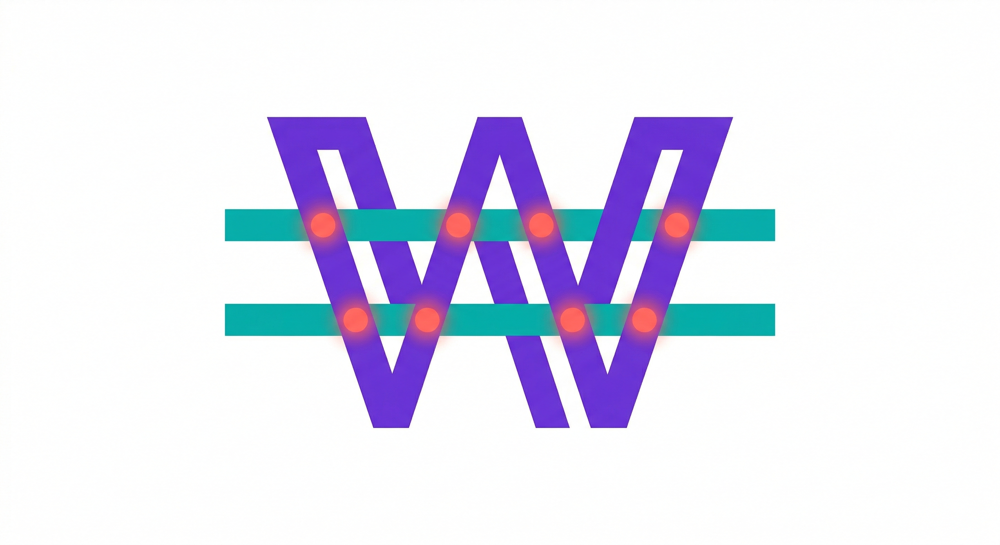
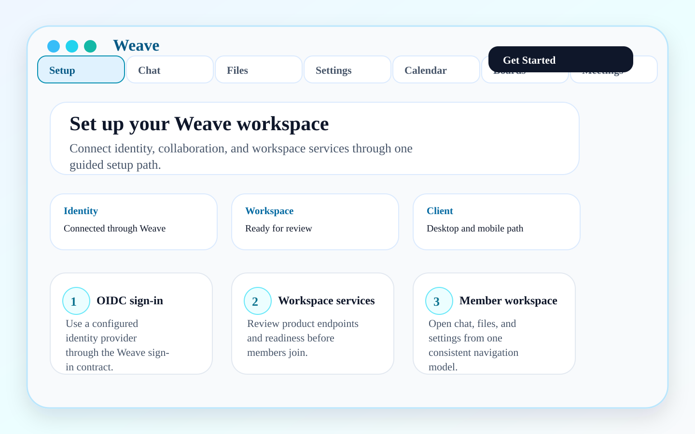
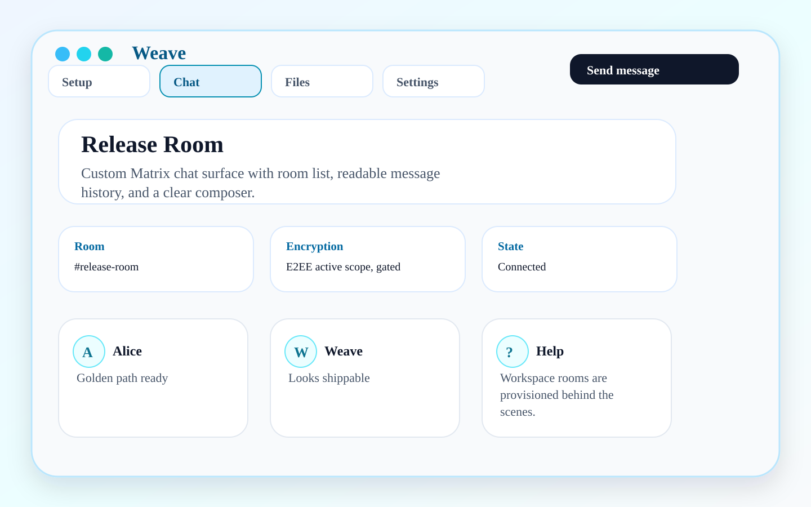
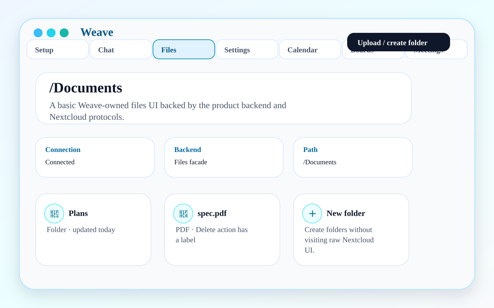
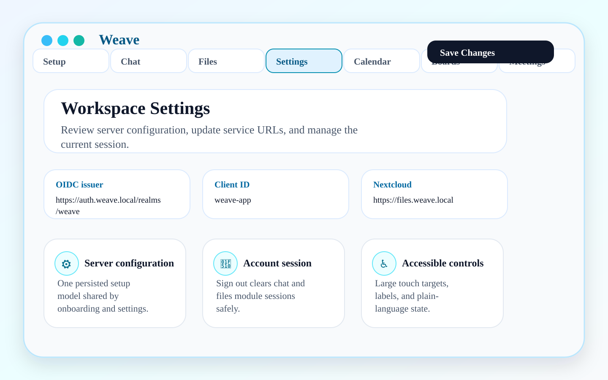

# Weave Monorepo

<p align="center">
  
</p>

Weave is an accessibility-first, provider-neutral, self-hostable organization operating layer. It gives members coherent work surfaces for messages, channels, files, calendars, boards/tasks, meetings, decisions, and workspace health while keeping provider selection, policy, readiness, audit, and operations under admin/operator control.

The point is not to re-skin a fixed vendor bundle. The point is to let an organization run Weave-owned product workflows over chosen adapters without exposing raw provider setup, secrets, or migration detail to normal members.

Current maturity is honest and evidence-scoped:

- **Ready for dogfood-production foundation:** repository orchestration, documentation site, release-note automation, provider-neutral domain contracts, admin/operator readiness boundaries, policy enforcement, and support-safe evidence checks.
- **In progress / guarded:** richer daily-work surfaces for calendars, boards/tasks, meetings, provider replacement, and release-candidate live-stack evidence. These stay fail-closed unless configured and evidenced.
- **Not shipped as v0.1 product scope:** broad marketplace administration, autonomous agent/team writes, public connector SDK, and the optional Weaver personal-assistant runtime.

## v0.1 Golden Path quick read

- [v0.1 Golden Path readiness](docs/v0.1-golden-path.md) for what reviewers can evaluate today.
- [Documentation landing page](docs/index.md) for audience-specific manuals and evidence maps.
- [Weave product line and Weaver integration plan](docs/product-line-and-weaver-plan.md) for current product ordering.
- [Sprint 5 closure report](docs/sprint-5-closure-report.md) for project-readiness evidence and release-candidate gaps.
- [Enterprise release foundation](docs/enterprise-release-foundation.md) for Sprint 6 release lanes, RC evidence, waiver rules, and support-safe artifacts.

## Product architecture

Weave ships as one product unit: `client/`, `server/`, `infra/`, `e2e/`, `docs/`, and `release/` move together.

Architecture at a glance:

1. **Member UX speaks Weave domains.** Chat, files, calendar, boards/tasks, meetings, decisions, manuals, and health are product concepts, not provider screens.
2. **Server facades own provider boundaries.** Authorization, capability states, provider mapping, migration evidence, support-safe errors, audit, and token handling stay behind backend/admin/operator APIs.
3. **Admins govern readiness and policy.** Workspace/Admin Health explains ready, disabled, degraded, policy-blocked, and admin-setup-required states without leaking secrets or downstream bodies.
4. **Operators get reversible infrastructure paths.** OpenTofu, backup/restore, smoke tests, support bundles, and release evidence are treated as product requirements.
5. **Accessibility is release-blocking.** Headings, keyboard paths, non-color-only status, text alternatives, and support-safe help are part of acceptance, not polish.

Weaver/AI PA positioning is deliberately later. Weaver is Weave's optional, governed per-user PA layer: opt-in, policy-governed, auditable, support-safe, and disabled by default. When promoted, its runtime is generated from Weave organization policy as an isolated per-user OpenClaw-derived profile. The governing rule is **user-rights, organization-whitelisted capabilities**; exec/elevated capabilities remain disabled unless an admin defines constrained policy. For approved developer contexts, the same governed model can reduce context switching across issues, docs, code review, and ACP/Codex-style coding assistance, but only through explicit organization-whitelisted capabilities. Details live in [product-line planning](docs/product-line-and-weaver-plan.md), [organization embedding](docs/organization-embedding-contract.md), and [roadmap/guarded surfaces](docs/roadmap-and-guarded-surfaces.md).

## Release notes

The managed block below is the README-facing draft of merged but unreleased changes. It is a review artifact, not proof that a release was published. Maintainers update it with the checked-in release-note tooling; do not edit inside the markers by hand.

<!-- WEAVE_RELEASE_NOTES_START -->
_Generated release notes are review artifacts. A release maintainer may update this block with `python3 tools/readme_release_notes.py --update --source <generated-notes>` before opening the release-draft review._

Use this page for release-affecting changes that have merged but are not included in a tagged release yet.

## Added

- MkDocs documentation site foundation with handbook navigation, diagrams, GitFlow/PR workflow, and release notes process.
- Root Gradle wrapper and orchestration tasks for delegated server, client, admin, infra, docs, acceptance, CI, and release-notes checks.
- Local release notes generator for merged PR metadata grouped by release-notes labels.
- Sprint 6 kickoff plan and initial Keycloak realm dry-run provider contract scaffold for admin-owned identity/provider operations.
- Enterprise release foundation with machine-checked release lanes, support-safe Live Stack evidence manifest, RC promotion/waiver contract, and required runtime marker policy.

## Changed

- Repositioned the root README as a Sprint 6 readiness/kickoff enterprise product entry point with audience-directed documentation navigation, explicit maturity status, Java 21 gate guidance, E2E/release-candidate evidence boundaries, and governed Weaver/AI PA boundaries.
- Added organization-embedding, identity-provisioning, and provider-replacement strategy contracts to make provider neutrality, mixed self-hosted/cloud/external deployments, and adapter replacement explicit before new feature slices.
- Documentation validation now has a dedicated docs check/build path.
- PR CI now enforces exactly one release-notes label before review/merge.
- `make release-notes-check` now verifies release-notes label edge cases and generator fixture output.
- Live Stack acceptance artifacts now include `release-evidence-manifest.json` with commit/run metadata, artifact list, support-safe exclusions, and the RC promotion rule.

## Fixed

- Nothing yet.

## Security

- Nothing yet.

## Accessibility

- Nothing yet.

## Migration/Operator Notes

- Operators can build the documentation site locally with `python3 -m pip install -r docs/requirements.txt` and `make docs-build`.

## Known Issues

- Nothing yet.
<!-- WEAVE_RELEASE_NOTES_END -->

## Product screenshots

Screenshots are deterministic, checked-in assets for current dogfood-ready product paths. They show Weave-owned surfaces and must not be used to imply that guarded or roadmap capabilities are shipped.

### Admin-provisioned setup

[](docs/assets/marketing/01-setup-start.svg)

Normal members join after setup; raw provider configuration is not the member path.

### Custom Weave chat

[](docs/assets/marketing/03-chat-room.svg)

Chat is a Weave product experience backed by the selected chat adapter.

### Weave files through the backend facade

[](docs/assets/marketing/04-files-documents.svg)

Files use Weave-owned routes and backend facades instead of exposing storage-provider UX as the everyday product identity.

### Settings and readiness

[](docs/assets/marketing/05-settings.svg)

Settings and readiness surfaces explain configured, disabled, degraded, or unsupported states without exposing secrets or raw provider errors.

## Repository layout

- `client/` — Flutter app, product UI, accessibility checks, and client-side contract tests.
- `server/` — Spring Boot product API/BFF, provider facades, authorization, audit, support-safe errors, and backend acceptance tests.
- `infra/` — Docker/OpenTofu operator stack, deployment scripts, provider profiles, backup/restore, smoke checks, and support bundles.
- `e2e/` — product-language Gherkin scenarios, scenario mappings, and sanitized evidence contracts.
- `docs/` — MkDocs-backed product, user/admin/operator/developer documentation, architecture, release scope, evidence, roadmap boundaries, and research notes.
- `release/` — release manifests and stack compatibility metadata.

## v0.1 product truth

v0.1 is dogfood-production, not a preview. A surface belongs only when it is useful for daily project work and backed by executable or documented release evidence.

Ready/required product foundation:

- admin-provisioned organization setup;
- Weave Home, personal messages, channels/workspaces, files, calendar, boards/tasks, meetings, decisions, manuals/help, and support-safe health states as Weave-owned domains;
- Workspace/Admin Health for readiness, degraded states, backups, smoke evidence, policy, and support bundles;
- deploy, update, backup, restore, rollback, smoke-test, and support-bundle paths for operators.

Guarded or future:

- provider replacement applies only where dry-run, authorization, lossy mapping, audit, rollback/restore, export/delete, and member-impact evidence exist;
- live-stack E2E remains release-candidate evidence and must be green or explicitly waived before promotion;
- Weaver remains optional, governed, per-user, disabled by default, and later than the current readiness foundation.

## Boards and provider boundary

Boards/Tasks is a Weave product surface. The client talks to the Weave backend facade and must not call task providers directly.

Current boundary:

- provider reads stay behind runtime gates, context authorization, support-safe metadata, and backend-held tokens;
- provider writes stay disabled/fail-closed unless future promotion proves authorization, user consent, audit publication, support-bundle redaction, and rollback behavior;
- local workspace user writes are v0.1 scope only when explicit, authenticated, authorized, audited, accessible, and covered by tests.

## Infrastructure and OpenTofu

OpenTofu is the operator tool for Weave infrastructure. Terraform-compatible names may still appear where they are ecosystem syntax, but user-facing workflows should say OpenTofu and use `tofu` commands unless documenting compatibility.

Operator rules:

- CI runs OpenTofu format/validation-oriented checks.
- State-destructive operations require operator confirmation plus backup, restore, or rollback evidence.
- Support bundles must redact secrets, tokens, raw provider errors, provider URLs, cookies, private keys, generated credentials, and personal data.
- Operator-specific setup belongs in [Admin/Operator Handbook](docs/admin-operator-handbook.md), not in member-facing product copy.

## Evidence contract

Gherkin scenarios are product contracts. For behavior changes:

1. Write or update the product scenario in `e2e/features/`.
2. Map it in `e2e/scenario_mappings.json`.
3. Add executable unit, contract, widget, integration, server, admin, infra, or documentation evidence.
4. Keep live-stack E2E sparse, sanitized, and focused on release-candidate-critical end-to-end contracts.
5. Store no secrets, tokens, cookies, private keys, raw provider errors, or personal data in evidence artifacts.

See [Quality and acceptance evidence](docs/quality-and-evidence.md) and [Developer Handbook](docs/developer-handbook.md).

## Release evidence

Release evidence is the review and verification trail for release-note automation and release-candidate promotion. The public release-note draft above is not enough; maintainers inspect checked-in artifacts, CI, and sanitized live-stack evidence or an explicit release-owner waiver.

<!-- WEAVE_RELEASE_NOTES:START -->
- Current checked-in draft: [Unreleased](docs/release-notes/unreleased.md)
- Offline fixture review artifact: `build/release-notes/unreleased.md` from `./gradlew generateReleaseNotes`
- Release evidence gate: `./gradlew releaseEvidenceCheck`
<!-- WEAVE_RELEASE_NOTES:END -->

## Common local gates

Use Java 21+ for Gradle gates. On macOS with Homebrew JDK 21, for example:

```bash
export JAVA_HOME=/opt/homebrew/opt/openjdk@21
export PATH="$JAVA_HOME/bin:$PATH"
```

Run the smallest meaningful gate for your change:

```bash
make docs-check
make acceptance-contract
make client-ci
make server-ci
make infra-static
make ci

./gradlew doctor
./gradlew docsCheck
./gradlew acceptanceContract
./gradlew releaseEvidenceCheck
./gradlew ci
```

Defaults:

- documentation/site/release-marker changes: `make docs-check` and `./gradlew releaseEvidenceCheck`;
- scenario mapping changes: `./gradlew acceptanceContract`;
- client/backend/admin/infra changes: the matching `clientCi`, `serverCi`, `adminCi`, or `infraStatic` gate;
- cross-stack changes: `./gradlew ci`;
- release-candidate promotion: protected CI plus sanitized live-stack E2E or an explicit release-owner waiver.

## Working agreements

- Keep documentation honest about shipped, guarded, disabled, degraded, and future surfaces.
- Keep normal-member UX provider-neutral; provider specifics belong in admin/operator readiness and support-safe diagnostics.
- Keep Weaver product-first and later: organization setup, provider categories, admin policy, readiness, and whitelisting come before PA runtime work.
- Prefer accessible headings, concise bullets, descriptive links, and alt text over dense tables.
- Do not expose provider secrets or service tokens to Flutter, support bundles, app config, logs, screenshots, or docs.
- See [Developer Handbook](docs/developer-handbook.md) and [Trunk-based PR and release workflow](docs/gitflow-pr-workflow.md) for contribution and merge rules.
