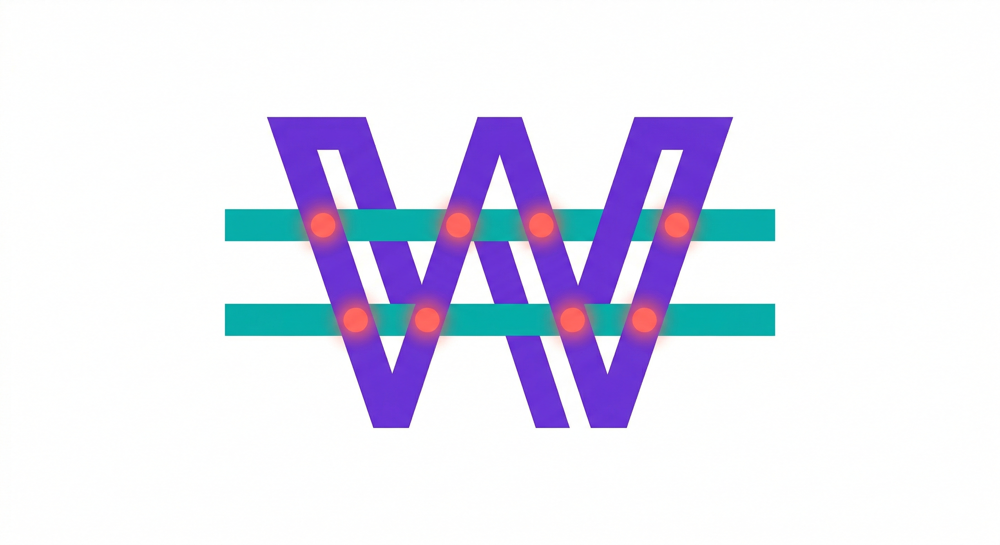
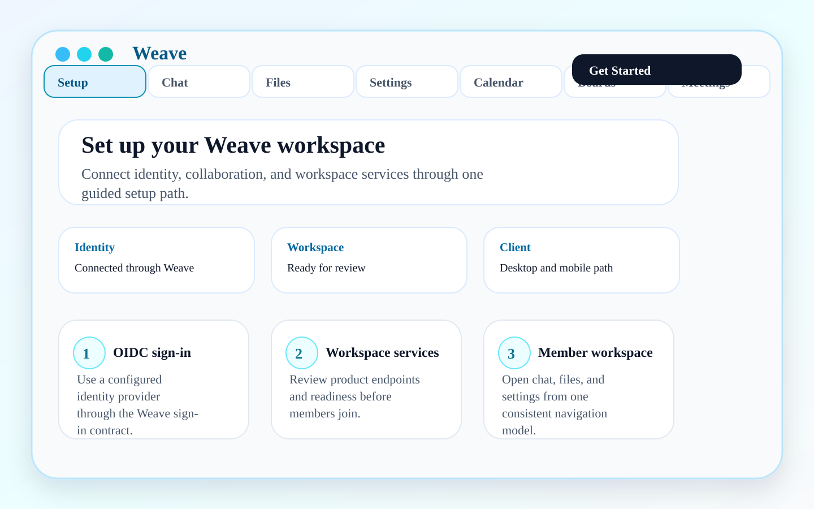
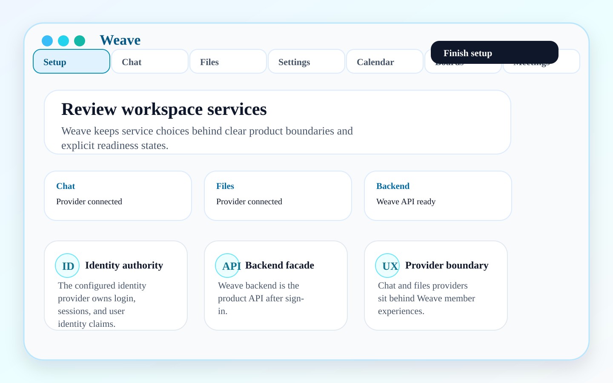
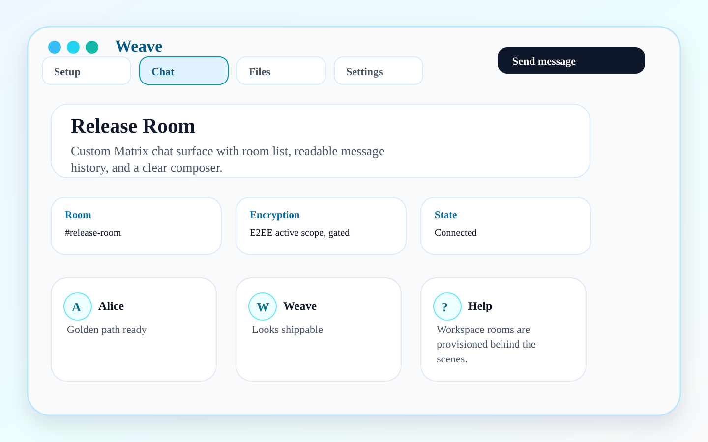
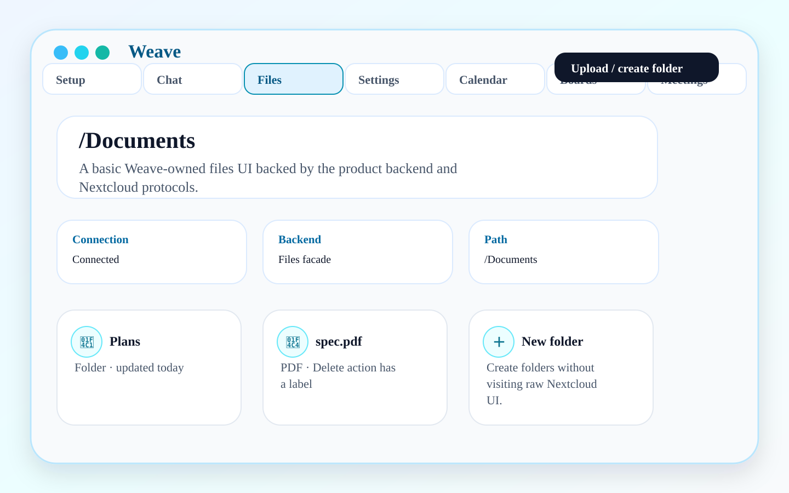
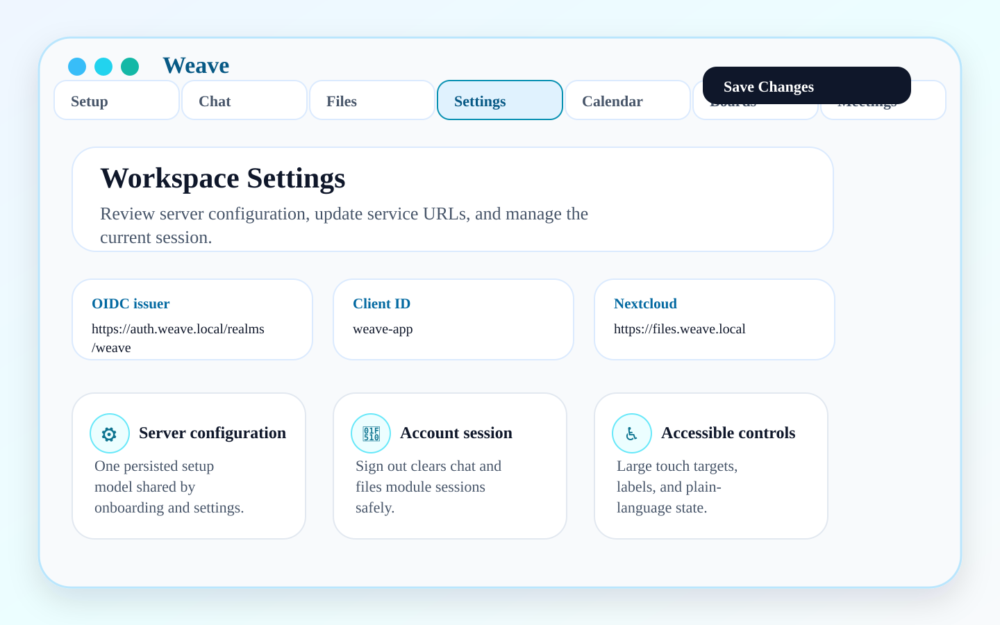

# Weave

<p align="center">
  
</p>

<p align="center">
  <a href="https://github.com/masssi164/weave/actions/workflows/ci.yml"></a>
  <a href="https://github.com/masssi164/weave/actions/workflows/live-stack-e2e.yml"></a>
</p>

**Accessible collaboration, under your control.**

Weave is a provider-neutral collaboration workspace for organizations that need modern daily work tools without handing their data, identity, or accessibility standards to a closed suite. The #1470 client contract is one OIDC sign-in, Files and Calendar through the generated Weave User API, and native Matrix chat through the bounded Weave Matrix Client-Server facade. Selected providers remain behind server-owned adapters. The integrated single-sign-in and native Matrix journeys are still acceptance work, not a shipped claim.

Weave is not a raw bundle of provider UIs and it is not claiming to be a finished Slack or Microsoft Teams clone. It is an active product-maturity build with honest feature gates: release surfaces are only shown as shipped when they have executable evidence, and unsafe provider paths fail closed.

## What Weave is for

- Privacy-sensitive teams, clubs, small organizations, public-sector/NGO/health/education groups, and self-hosters who want one polished front door over open collaboration services.
- Operators who need repeatable deployment, health checks, readiness states, backups, and support diagnostics without exposing secrets.
- Users who need an accessible workspace shell with clear recovery states instead of scattered admin/protocol screens.

## Product pillars

- **Accessible workspace shell:** setup, sign-in, navigation, settings, recovery states, semantic labels, keyboard/screen-reader-friendly flows, and non-color-only status.
- **Sovereign collaboration:** chat, files, and calendar foundations presented through Weave-owned UX instead of raw provider screens.
- **Backend-owned provider boundary:** Flutter uses generated User API operations and transport models for Weave HTTP capabilities. It does not call provider runtimes directly. Chat keeps the native Rust/Matrix SDK against Weave's Matrix facade.
- **Honest readiness:** provider status, capability snapshots, degraded states, and fail-closed errors are visible without leaking backend actor tokens, provider URLs, raw errors, or secrets.
- **Operator-grade validation:** offline checks stay cheap for normal PRs; live-stack E2E runs only when the full stack and runner budget are explicitly available.

## Available now

The current app lets contributors evaluate these product surfaces directly:

- guided workspace setup and service endpoint review;
- OIDC sign-in and persisted server configuration;
- custom native Matrix chat shell with explicit recovery/retry states;
- generated User API Files browsing and actions, and a provider-backed Calendar surface;
- settings/profile/session controls;
- workspace, Matrix E2EE, and provider-stack readiness views that stay support-safe.

## Gated scope and non-goals

These areas are active product scope, but the app must keep them fail-closed until the backend facade, permission, audit, accessibility, and evidence gates are ready:

- **Shared calendars:** the current supported agenda and event operations use the generated User API and an active provider. Wider workspace, team, and channel scheduling remains gated where backend, permission, and UI evidence is incomplete. Private personal calendar ingestion is not a product goal.
- **Boards/tasks:** provider-neutral Weave UX and backend contracts with explicit user writes, authorization, audit, support-safe errors, and non-drag task work.
- **Meetings/video calls:** LiveKit is the provider contract; join/start remain fail-closed until backend token, media, metadata, and encryption evidence gates are configured and validated.
- **Matrix E2EE:** active architecture path, not a completed claim. Weave must validate encrypted rooms, device verification, key backup/recovery, multi-device behavior, metadata boundaries, and accessibility before claiming production readiness.
- **Interop/connectors:** Slack/Teams/connector routes default off and remain backend-owned. No client-side provider shortcuts.
- **Personal agents/automation:** later roadmap, not README hero scope.

## Product screenshots

A first look at the active product-maturity experience: guided setup, service review, custom chat, basic files, and workspace settings in one Weave product shell. These screenshots are deterministic SVGs generated from checked-in source, so the README stays reviewable and reproducible without turning documentation into image-only content.

### Setup and service review

[](../docs/assets/marketing/01-setup-start.svg)

[](../docs/assets/marketing/02-review-service-endpoints.svg)

### Daily collaboration

[](../docs/assets/marketing/03-chat-room.svg)

[](../docs/assets/marketing/04-files-documents.svg)

### Workspace settings

[](../docs/assets/marketing/05-settings.svg)

Regenerate screenshots with `make marketing-screenshots`, validate [the screenshot evidence manifest](../docs/assets/screenshot-evidence.json), and review the SVG diff before committing. Additional gated surfaces are documented in [Roadmap and guarded surfaces](../docs/roadmap-and-guarded-surfaces.md) so the main showcase does not overclaim unfinished product areas.

## Monorepo architecture

Weave is developed as one monorepo with dedicated product-stack directories:

- `../client`: Flutter app, app shell, accessibility, chat/files/settings UX, provider-readiness presentation, and app tests.
- `../server`: Spring Boot product API/BFF, JWT validation, profile/files/calendar/provider facades, readiness, support-safe errors, audit seams, and backend contracts.
- `../infra`: Docker/OpenTofu stack, Caddy routing, Keycloak, optional southbound Matrix and Nextcloud providers, backups, smoke checks, and the isolated E2E environment.
- `../e2e`: product-language Gherkin, scenario mapping, and sanitized evidence contracts.
- `../release`: stack manifests and release metadata.

Responsibility split:

- Keycloak owns identity.
- Weave Server owns the bounded Matrix Client-Server northbound facade, canonical Chat state, current authorization and routing through `ChatProviderPort`; Rust/Ruma/JNI owns the narrow Matrix wire boundary. A selected Matrix provider is southbound, not the client contract.
- The selected Files and Calendar providers own their specified payloads; Nextcloud is a default adapter option rather than a product dependency.
- Weave Server owns generated User/Admin APIs, readiness, provider facades, secret boundaries, errors, audit and provider gating.
- Weave Flutter owns the daily product experience. The #1470 admission contract requires its authorized member OIDC/PKCE session to admit the Weave-owned Matrix SDK path without a second user-facing login; #1475/#1480 track the real integration proof.
- Caddy and infrastructure own routing, TLS, deployment, smoke checks, backups, restore smoke, and support diagnostics.

For details, see:

- [Flutter architecture](docs/architecture.md)
- [Developer handbook](docs/developer-handbook.md)
- [Quality and acceptance evidence](docs/quality-and-evidence.md)
- [Acceptance contracts](docs/acceptance-contracts.md)
- [Roadmap and guarded surfaces](../docs/roadmap-and-guarded-surfaces.md)

## Local development

```sh
flutter pub get
flutter run
```

### App start / member join contract

Weave has one member startup flow: open a support-safe `/join` link, load public `/api/platform/config`, save OIDC/API/facade configuration, start SSO, then show the workspace home.

- Production/customer entry: `https://<weave-link-domain>/join?...` via iOS Universal Links / Android App Links where the domain is in the app association contract.
- Local iPhone dogfood: use the same `/join` contract when possible; `weave:/join?...` is only the local-dev fallback when Universal Link verification cannot work for IP/self-signed setups.
- Do not reinstall the app during startup. Keep the stable bundle/package identity and OIDC redirects: `com.massimotter.weave:/oauthredirect` and `com.massimotter.weave:/logout`.
- The member app must not ask users for Matrix/Nextcloud/provider URLs, secrets, diagnostics, or admin control-plane details.
- Local self-signed HTTPS still requires installing/trusting the local CA on the device because Safari/AppAuth use system trust.

The app-link association artifacts live in `client/app-links/`. iOS Associated Domains are enabled only for Release builds because Apple Personal Development Teams cannot provision that capability; local `flutter run`/Debug uses the `weave:/join?...` fallback. Android release App Links require replacing the template fingerprint with the release signing certificate fingerprint before publishing.

### Android identity and release signing

Android debug builds use the Weave package id `com.massimotter.weave`; the OIDC redirect scheme stays `com.massimotter.weave`, so app-auth provider configuration must still allow `com.massimotter.weave:/oauthredirect` and `com.massimotter.weave:/logout` after package-id changes.

Release artifacts are intentionally fail-safe. The Android release build does not fall back to debug keys. To build a signed release artifact, create a local, untracked `client/android/key.properties` file:

```properties
storeFile=/secure/path/weave-release.jks
storePassword=...
keyAlias=weave-release
keyPassword=...
```

Then run:

```sh
flutter build appbundle --release
```

Without that complete file and keystore, release artifact tasks fail with an explicit signing-credentials error; use `flutter run` or debug/profile builds for local development.

Full lightweight validation:

```sh
flutter pub get
flutter gen-l10n
dart run build_runner build --delete-conflicting-outputs
dart format --output=none --set-exit-if-changed .
flutter analyze --fatal-infos
flutter test
make offline-contract-test
```

## Live stack and E2E

Use the root `testApp` lifecycle when a change needs real Keycloak, Matrix,
Nextcloud, backend, MCP, or provider-stack evidence.

Default local stack flow:

```sh
cd ..
./gradlew testApp
```

Useful targets:

- `make offline-contract-test`: automatic no-network contract gate.
- `make integration-test`: PR-safe client mapping, release-spine, and open-standard contract checks.
- `make physical-device-auth-e2e`: interactive activation, AppAuth system-browser sign-in, workspace restore, and refresh on a connected physical device; only endpoint and client-ID build arguments are accepted.
- `../gradlew testApp`: disposable full product flow with invitation, browser activation, Authorization Code + PKCE, generated User API Files/Calendar, Weave Matrix facade, MCP `files.search`, revocation, restart and cleanup. This command is not a physical Flutter-device journey.
- `make marketing-screenshots`: regenerate README/roadmap SVG assets.

The GitHub Actions product-flow path runs `testApp` on a dedicated self-hosted
runner. Physical-device evidence remains an explicitly separate manual gate.

## Accessibility baseline

Accessibility is a release gate, not polish:

- interactive targets are at least `48x48` logical pixels;
- icon-only actions expose semantic labels;
- complex layouts keep predictable reading order;
- setup, sign-in, shell navigation, chat, files, settings, readiness, and error states remain screen-reader friendly;
- status is never conveyed by color alone;
- user-facing failures are plain-language and actionable.

## Code layout

```text
lib/
├── core/             # bootstrap, failure model, persistence, router, theme, shared widgets
├── integrations/     # reusable backend/platform boundaries
└── features/         # auth, chat, files, calendar, onboarding, settings, app shell
```

Inside each feature:

- `presentation/`: screens, widgets, and Riverpod UI state.
- `domain/`: entities and repository contracts.
- `data/`: repositories, persistence adapters, DTOs, and service clients.

Shared integrations follow the same layering under `lib/integrations/<integration>/` when multiple features need one protocol or platform boundary.
