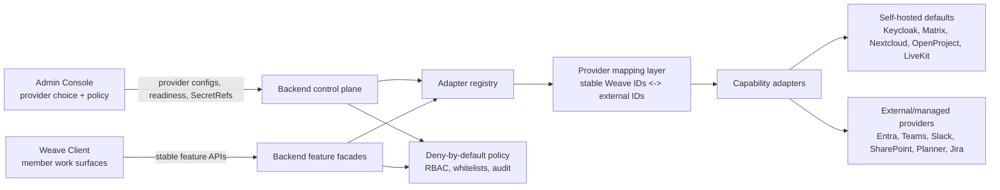

# Canonical feature models and provider facades

Status: active Sprint 3 architecture contract.

Canonical feature models come before control-plane, admin-console, infra, or adapter implementation. The member client and Admin Console consume stable Weave contracts; they never call Matrix, Slack, Microsoft Graph, Nextcloud/WebDAV, OpenProject, Keycloak, LiveKit, WOPI, or similar provider APIs directly. Organization embedding and provider replacement are defined in [Organization embedding contract](organization-embedding-contract.md), [Identity provisioning strategy](identity-provisioning-strategy.md), and [Provider replacement and anti-silo contract](provider-replacement-and-anti-silo-contract.md).

Provider selection is category-first. The self-hosted dogfood stack is the recommended default where it is sensible, but an organization may choose external or managed providers per capability. The backend owns provider mapping, adapter readiness, `SecretRef` resolution, policy, whitelisting, audit, and support-safe error shaping. Server facades expose Weave-owned models per capability; they are not thin provider proxies.

## Non-negotiable boundaries

- Canonical models are the product surface. Provider schemas are adapter input/output only.
- Every domain object has a stable Weave ID. Provider IDs live only in backend-owned mapping tables and audit-safe adapter traces.
- Admin/provider policy decides whether a capability is `ready`, `disabled`, `degraded`, or `policy-blocked` for a member. `usable` is only plain-language copy for `ready`, not a separate contract state.
- Policy is deny-by-default. Unknown role/group/provider states do not grant capability access.
- Secrets are stored and displayed only as `SecretRef` handles. Raw secrets, bearer tokens, provider URLs with credentials, downstream bodies, and provider-internal IDs do not appear in member responses, diagnostics, support bundles, or acceptance evidence.
- Lossy mappings are explicit adapter behavior, not accidental UI leaks.

## Facade architecture

The diagram source lives in [`docs/diagrams/architecture_facade.mmd`](diagrams/architecture_facade.mmd). All canonical diagram sources are discoverable from the MkDocs [Diagrams](diagrams/index.md) hub and linked below by domain.

## Cross-capability primitives

| Primitive | Purpose |
| --- | --- |
| `WeaveId` | Stable UUID-like product ID exposed to clients. |
| `ProviderMapping` | Backend-only relation between Weave ID, provider config, provider type, external ID, and mapping status. |
| `CapabilityPolicy` | Organization policy deciding capability availability and allowed operations. |
| `SecretRef` | Opaque reference to a secret resolver; never the secret value. |
| `Readiness` | Support-safe provider/capability health state with redacted diagnostics. |
| `AuditEvent` | Append-only record of policy decisions, provider operations, mapping loss, and admin changes. |
| `Extension` | Namespaced JSON metadata for provider-specific fields that must not pollute the canonical core. |

## Chat canonical model

Entities: `Space`, `Conversation`, `Message`, `Thread`, `Reaction`, `Attachment`, `Membership`, and `Presence`.

The chat canonical set is Space, Conversation, Message, Thread, Reaction, Attachment, Membership, and Presence.

The chat facade maps Matrix rooms/events/reactions, Slack conversations/messages/threads, and Microsoft Teams channels/chatMessages into the same conversation and message model. `Message.threadId` and `Message.parentMessageId` represent thread membership without leaking `event_id`, Slack `ts`, or Graph `chatMessage.id`. Rich provider artifacts such as Slack Block Kit or Teams Adaptive Cards degrade to safe text/HTML plus extensions when no canonical equivalent exists.

Required API groups: conversation listing and creation, message history and send/edit/delete, reactions, attachments, membership, role mapping, and presence.

Diagram: [`docs/diagrams/er_chat.mmd`](diagrams/er_chat.mmd).

## Files, documents, and office canonical model

Entities: `Drive`, `Node`, `Folder`, `File`, `Version`, `Share`, `Permission`, `Lock`, and `EditSession`.

The files/docs canonical set is Drive, Node, Folder, File, Version, Share, Permission, Lock, and EditSession.

The files/docs facade maps WebDAV/Nextcloud, CMIS repositories, Microsoft Graph `driveItem`, object storage, and WOPI-compatible office editors into one node hierarchy. WOPI is a backend boundary: the client receives a Weave edit session and safe launch metadata, not storage-provider credentials. Locks, optimistic change tokens, explicit checkout, implicit autosave versions, public links, and internal shares normalize to canonical permission and version records.

Diagram: [`docs/diagrams/er_files_docs.mmd`](diagrams/er_files_docs.mmd).

## Calendar and meetings canonical model

Entities: `Calendar`, `Event`, `Attendee`, `Recurrence`, `Availability`, `Resource`, `Meeting`, `Participant`, `Recording`, and `Captions`.

The calendar/meetings canonical set is Calendar, Event, Attendee, Recurrence, Availability, Resource, Meeting, Participant, Recording, and Captions.

The calendar/meetings facade maps CalDAV/iCalendar, Microsoft Graph calendar/onlineMeeting, and LiveKit rooms/participants/egress into stable scheduling and meeting records. RRULE/time-zone semantics are normalized before client use. Meeting tokens, media provider secrets, room SIDs, egress IDs, and webhook payloads remain backend-only mapping data.

Diagram: [`docs/diagrams/er_calendar_meetings.mmd`](diagrams/er_calendar_meetings.mmd).

## Boards and tasks canonical model

Entities: `Board`, `List`, `Task`, `Status`, `Assignee`, `Comment`, `Attachment`, `Dependency`, and `CustomField`.

The boards/tasks canonical set is Board, List, Task, Status, Assignee, Comment, Attachment, Dependency, and CustomField.

The boards/tasks facade maps OpenProject projects/work packages/statuses, Microsoft Planner plans/buckets/tasks, and Jira-like issues into one task model. OpenProject is the recommended first vertical slice because it exercises identity, RBAC, status workflow, custom fields, comments, attachments, dependencies, optimistic locking, and audit. Planner-like adapters may lose custom fields, complex workflow transitions, or multi-assignee fidelity; those losses are recorded in adapter metadata and support-safe audit.

Diagram: [`docs/diagrams/er_boards_tasks.mmd`](diagrams/er_boards_tasks.mmd).

## Identity, admin, and policy canonical model

Entities: `Organization`, `User`, `Group`, `Role`, `ProviderConfig`, `CapabilityPolicy`, `Whitelist`, `SecretRef`, `Readiness`, and `AuditEvent`.

The identity/admin canonical set is Organization, User, Group, Role, ProviderConfig, CapabilityPolicy, Whitelist, SecretRef, Readiness, and AuditEvent.

The identity/admin facade maps Keycloak, Entra ID, Authentik/Auth0/OIDC/SAML, SCIM, and LDAP-style systems into stable organization, user, group, role, and policy records. Keycloak is the self-hosted default; Entra or other OIDC/SAML sources are valid external choices. LDAP/AD is normally an upstream directory source through an identity broker or provisioning bridge. Immutable provider identifiers, such as issuer+subject, SCIM externalId, Entra object ID, or LDAP/AD objectGUID/objectSid, anchor mappings; email is never a primary identity key. Admins configure provider posture, readiness, whitelists, source ownership, role/group mapping, guest policy, service principals, and deprovisioning behavior. Members see only effective capability states.

Diagram: [`docs/diagrams/er_identity_admin.mmd`](diagrams/er_identity_admin.mmd).

## Adapter registry contract

Sprint 3 freezes these implementation boundaries for later vertical slices:

- per-capability provider interfaces (`ChatProvider`, `FilesProvider`, `CalendarProvider`, `BoardsProvider`, `IdentityProvider`) stay backend-owned;
- adapter registry lookup is by organization, capability, provider posture, readiness, and policy;
- mapper contracts return canonical models plus mapping-loss notes;
- readiness probes return support-safe state only;
- authorization hooks that evaluate `CapabilityPolicy` before any provider access;
- audit emits admin changes, denied access, provider writes, readiness transitions, and lossy mapping.

PR C should prove the first vertical slice with Identity/Keycloak plus Boards/Tasks/OpenProject and a Planner-like placeholder behind the same Weave boards/task model. Admin Console, infra, and support bundles consume the registry/readiness contracts rather than raw provider-specific assumptions.
