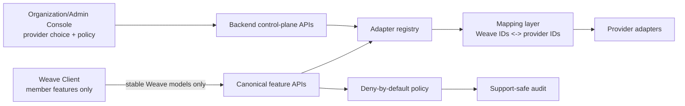

# Diagrams

These Mermaid sources make the canonical feature/capability model discoverable from the documentation site. The canonical model narrative lives in [Canonical feature models and provider facades](../canonical-feature-models.md).

MkDocs Material renders inline Mermaid fences in Markdown pages. The checked-in `.mmd` files remain source artifacts and are linked here so they can also be linted or rendered by external Mermaid tooling later.

## Facade architecture

- [Facade architecture source](architecture_facade.mmd)

## Domain ER sources

- [Chat ER source](er_chat.mmd)
- [Files and documents ER source](er_files_docs.mmd)
- [Calendar and meetings ER source](er_calendar_meetings.mmd)
- [Boards and tasks ER source](er_boards_tasks.mmd)
- [Identity, admin, and policy ER source](er_identity_admin.mmd)

## Boundary rule

The client and Admin Console consume stable Weave APIs/manifests. Provider-specific SDKs, external IDs, SecretRefs, readiness probes, raw provider URLs, and adapter diagnostics stay behind backend/admin/operator boundaries.
