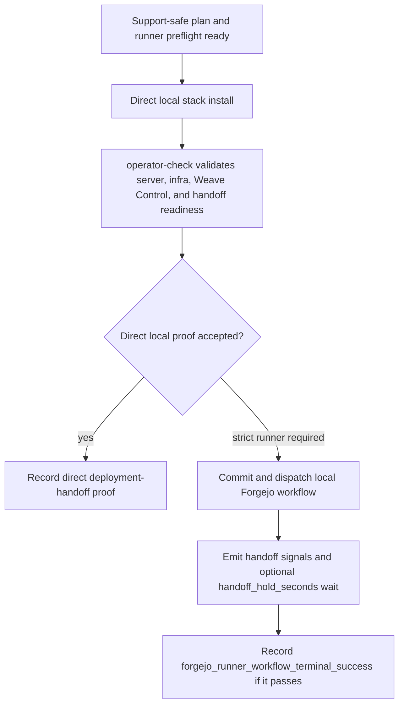
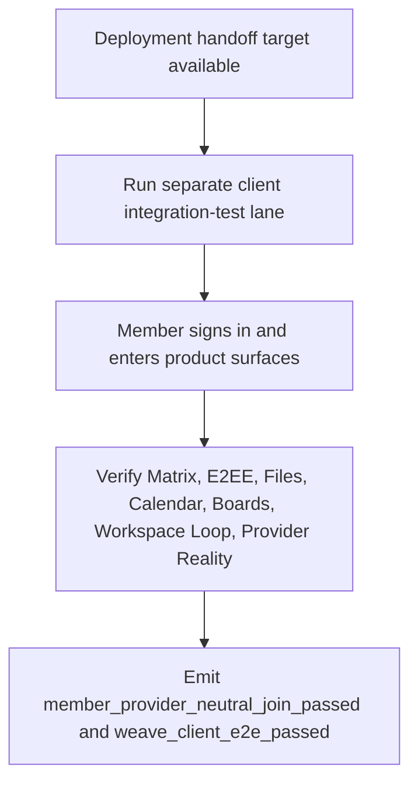

# Local Forgejo deployment and client E2E handoff

Status: Sprint 27 / #665 has **strict local Forgejo-runner deployment-handoff proof** and **separate client E2E proof against that runner-deployed handoff**. The proof is support-safe and correlated by commit, image revision, Forgejo run, task, and external client lane.

## Scope

#665 may close under the strict local evidence boundary:

- local Forgejo `workflow_dispatch` ran the committed `weave-admin-setup-e2e` workflow;
- backend image revision matched the dispatched commit;
- the runner emitted only deployment-handoff booleans and held the live stack for the external client lane;
- the separate client lane passed against that held runner-deployed handoff.

No production cutover or release-ready claim is made here.

## Required upstream evidence

- Bootstrapper plan: `release/provider-lab/local-cicd-bootstrapper/support-safe-plan.fixture.json`.
- Real runner readiness: `release/provider-lab/local-forgejo-runner-readiness/runner-readiness.fixture.json` plus the verified concise `~/server` signal from main/operator local DevOps work.
- Deployable domain plan from #664: `release/provider-lab/local-domain-plan/deployable-domain-plan.fixture.json`.
- Pipeline dispatch/status `PipelineRunRef` from #663: `release/provider-lab/admin-cicd/local-forgejo-pipeline-provider.fixture.json`.

## Direct local deployment-handoff proof

Support-safe current-working-tree proof:

- `infra/weave-workspace/install.sh` completed the local Weave stack deployment;
- `WEAVE_IAC_BIN=tofu bash ./operator-check.sh` completed with `Operator checks passed.`;
- `server_infra_readiness_passed`: true for the direct local stack proof;
- `weave_control_ready`: true for the direct local stack proof;
- `client_bootstrap_handoff_ready`: true for the direct local stack proof;
- raw logs, endpoint URLs, provider payloads, secrets, tokens, tenant URLs, Matrix URLs, and member content were not persisted in repo evidence.

This is not claimed as `forgejo_runner_workflow_terminal_success`; the current working tree has not been committed/pushed/dispatch-run through local Forgejo.

## Separate client-lane proof

Support-safe current-working-tree proof:

- command ref: `client/Makefile integration-app-e2e`;
- Makefile fail masking was fixed so an earlier failing Flutter E2E cannot be hidden by a later passing test;
- the separate client lane passed against the local Forgejo runner-deployed handoff target while `handoff_hold_seconds=1800` kept it available;
- observed support-safe marker classes: `AUTH_RESULT`, `PROFILE_RESULT`, `CHAT_RESULT`, `MATRIX_RESULT`, `E2EE_RESULT`, `FILES_RESULT`, `CALENDAR_RESULT`, `BOARDS_RESULT`, `WORKSPACE_LOOP_RESULT`, and `PROVIDER_REALITY_RESULT`;
- `member_provider_neutral_join_passed`: true for the separate client lane;
- `weave_client_e2e_passed`: true for the separate client lane.

E2EE boundary: the client proof requires an encrypted Matrix room and encrypted wire event with no plaintext leak. `recoveryRequired` is accepted only as an honest security-posture state, not as a healthy-recovery claim.

## Forgejo workflow boundary

The Forgejo deployment runner must stay client-free. It is a Weave Control deployment lane for stack/bootstrap operations and may emit only deployment-handoff booleans:

- `pipeline_terminal_success`;
- `server_infra_readiness_passed`;
- `weave_control_ready`;
- `client_bootstrap_handoff_ready`.

It must not install Flutter, Linux desktop dependencies, Xvfb/GTK, or any app/client E2E harness, and must not emit `member_provider_neutral_join_passed` or `weave_client_e2e_passed`. Those client signals come only from the separate app/client lane against the handoff target. Admin Console views may display the sanitized deployment refs and separate client-lane refs together, but the evidence source remains split so support can tell deployment readiness from member/app proof.

For strict #665 proof the workflow supports `handoff_hold_seconds`: default `0` keeps immediate cleanup, while an approved dispatch may hold the deployed handoff open briefly so the external client lane can run against the runner-deployed target before teardown.

## Current support-safe Forgejo-runner evidence

- commit: `c0470eec04232b2271e49a82566796d66aab99d7`;
- backend image revision: `c0470eec04232b2271e49a82566796d66aab99d7`;
- backend image id: `sha256:0f299fd6c6b46086b9a6fe3f08b95a6d3dfdaa2bfeb0f47417d8051f72304fc2`;
- workflow event: local Forgejo `workflow_dispatch`;
- opaque run ref: `local-forgejo-actions-run-121`;
- opaque job ref: `local-forgejo-actions-job-235`;
- opaque task ref: `local-forgejo-actions-task-220`;
- terminal status: success;
- task log storage: true;
- dispatch input: `handoff_hold_seconds=1800`;
- OIDC discovery was ready during the handoff window;
- DB/log evidence shows checkout, prerequisites, backend image verification, stack bootstrap, public hostname routing, operator-check, terminal signal emit, 1800s handoff hold, cleanup, and job success;
- raw logs, endpoint URLs, provider payloads, secrets, tokens, tenant URLs, Matrix URLs, and member content were not persisted in repo evidence.

## Responsibility split evidence

The current proof keeps the productized split explicit:

| Surface | Evidence in this slice | Boundary kept |
| --- | --- | --- |
| Weave Control | local stack install/operator-check proof, Forgejo workflow handoff booleans, `handoff_hold_seconds` support. | Deployment/bootstrap only; no app/client E2E execution or member content. |
| Admin Console | readiness/evidence state and support-safe refs for operators/admins. | Shows refs and next-action codes only; no raw logs, endpoints, payloads, secrets, or runtime config. |
| Weave App / Client | separate `client/Makefile integration-test` proof and member capability markers. | Consumes handoff target; does not configure providers or bootstrap infrastructure. |
| Weaver | future optional organization capability/governance category only. | No v0.1 Spec 0001 Weaver/AI runtime claim, no raw OpenClaw config, and no autonomous PA availability claim. |

## Admin Console readiness/evidence state

The Admin Console handoff state is evidence-first and fail-closed:

- before dispatch it may show runner, deployable-plan, SecretRef-name, and approval readiness without secret values;
- after dispatch it may show only a support-safe `PipelineRunRef`, terminal status, sanitized evidence refs, direct local proof refs, separate client-lane evidence refs, and support-safe summaries;
- strict Forgejo-runner closure is satisfied by `local-forgejo-actions-run-121`; production cutover and release-readiness remain separate approval gates.

## Failure cases

The #665 handoff must remain blocked and support-safe for:

- missing test credential or SecretRef name;
- server/infra not ready;
- separate app/client E2E failed;
- pipeline/status timeout or unknown terminal state;
- evidence redaction failure.

## Activity boundary

The deployment activity remains split from the client activity:

## Current claim boundary

The current repo artifact status is `forgejo_runner_handoff_and_separate_client_e2e_passed`. It may claim #665 local evidence closure for the strict Forgejo-runner handoff boundary: committed workflow, correlated backend image revision, local Forgejo run/task refs, `handoff_hold_seconds=1800`, OIDC-ready live stack during hold, and separate client E2E passed against that handoff. It must not claim production cutover or release readiness.
