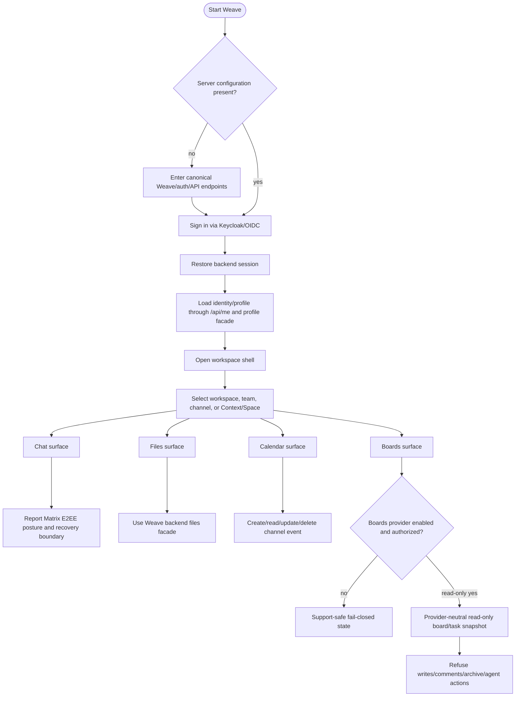
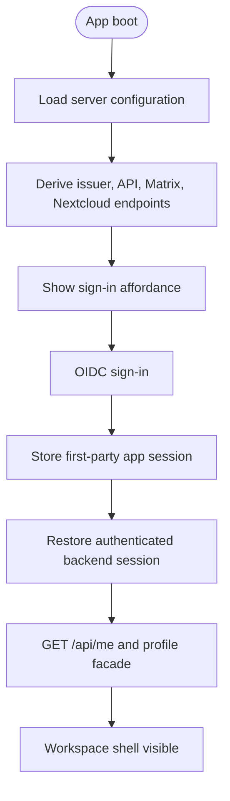
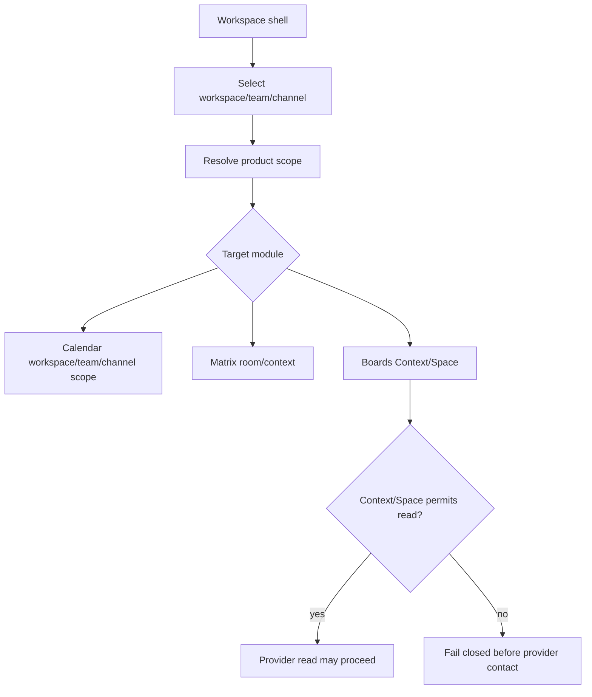
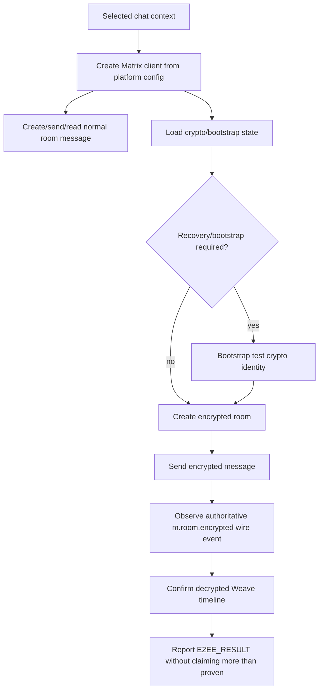
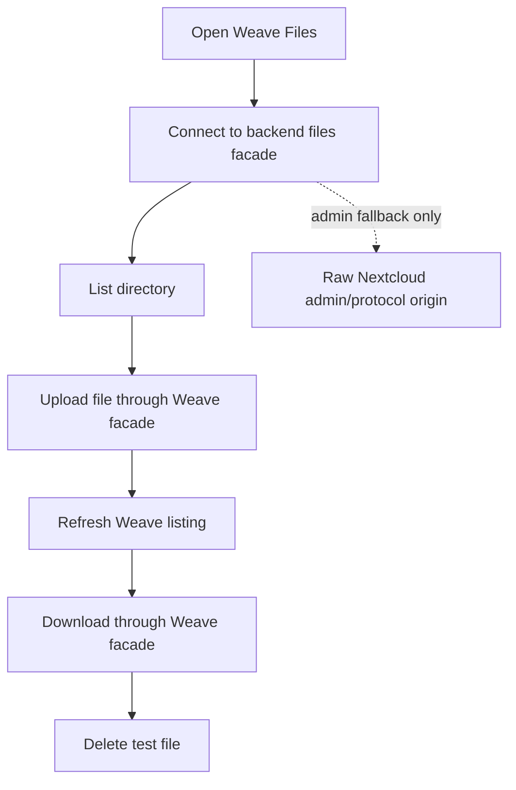
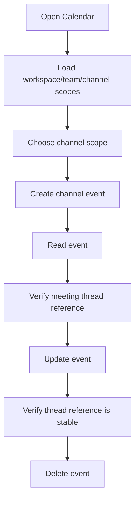
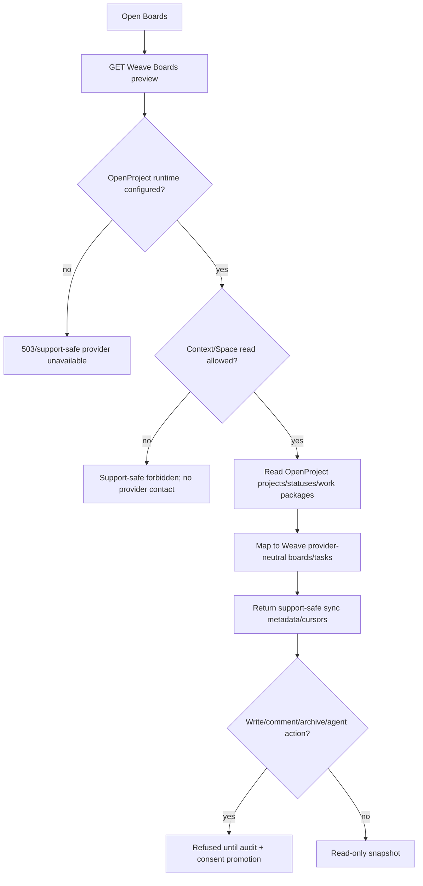
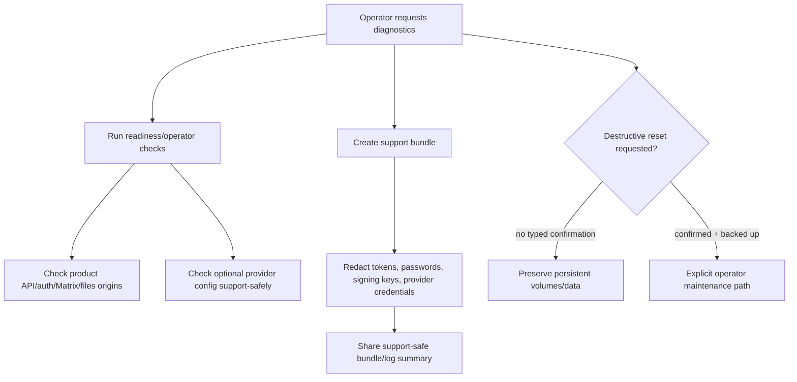

# Weave product acceptance flows

Status: reviewable product-flow baseline for Massimo; executable evidence is mapped in the acceptance files listed below.

These flows keep the product order explicit: describe the user journey first, then map only the relevant parts to deterministic Cucumber/Gherkin/E2E gates. They are not a broad test zoo.

## General product flow summary

A Weave user signs in once, lands in the workspace shell, chooses the relevant workspace/team/channel context, and then uses Weave-owned surfaces for chat, files, calendar, and boards. Matrix and Nextcloud stay sovereign provider modules behind the Weave experience. OpenProject is a backend-owned read-only boards provider path when configured; provider writes, comments, archive, and agent actions remain refused until audit and consent promotion exists.

## Flow 1: Sign-in and workspace shell boot

Purpose: prove one login restores the Weave product shell and canonical profile identity.

Acceptance evidence:
- `weave/acceptance/live_stack_app.feature` scenario `@weave-live-auth-shell`.
- `weave/acceptance/scenario_mappings.json` maps the scenario to `AUTH_RESULT` and `PROFILE_RESULT`.
- `weave/integration_test/live_stack_app_e2e_test.dart` prints the mapped markers and verifies profile load/update/reload/restore.
- `weave/test/live_stack_feature_mapping_test.dart` prevents the readable scenario from drifting away from executable evidence.

## Flow 2: Workspace/team/channel and Context/Space selection

Purpose: keep collaboration scope explicit before module actions run. Team/channel language is a product projection; provider-backed boards must still resolve through Context/Space authorization.

Acceptance evidence:
- Backend Cucumber `@backend-openproject-context-space-gate` proves missing Context/Space authorization exposes no provider data and does not contact OpenProject.
- Infra scenario `@infra-openproject-context-gate` maps the same expectation to the live Weave API gate.
- Calendar scope coverage is in `@weave-live-calendar-threadrefs`.

## Flow 3: Matrix chat and E2EE posture/recovery boundary

Purpose: prove Weave chat can send/read Matrix messages while being honest about E2EE readiness, encrypted wire evidence, and recovery state.

Out of scope for this acceptance layer: claiming complete human device-verification UX, long-term recovery UX, or federation behavior.

## Flow 4: Files product boundary vs raw provider/protocol fallback

Purpose: users use Weave Files, while raw Nextcloud remains admin/protocol fallback only.

Acceptance evidence:
- `@weave-live-files-boundary` maps to browse/upload/download/delete through the backend facade.
- Raw Nextcloud is not promoted as normal product UX.

## Flow 5: Calendar workspace/team/channel event and meeting-thread reference

Purpose: channel events round-trip through Weave and keep a stable meeting-thread reference for future chat/meeting linkage.

Acceptance evidence:
- `@weave-live-calendar-threadrefs` maps to the live Flutter E2E and checks create/read/update/delete plus stable thread reference.

## Flow 6: Boards/OpenProject read-only provider path and write refusal gates

Purpose: keep OpenProject behind the Weave backend facade, read-only first, context-scoped, and support-safe.

Acceptance evidence:
- `weave-backend/src/test/resources/features/openproject-boards-readonly.feature` is executed by the real Cucumber/JUnit suite.
- `weave-infra/acceptance/openproject_boards_live_stack.feature` maps the same live-stack boundaries to `weave-workspace/openproject-boards-live-e2e.sh`.
- `weave/acceptance/live_stack_app.feature` keeps app-facing Boards preview/non-drag task behavior mapped to the Flutter E2E.

Out of scope until a later audited promotion: provider writes, comments, attachments, archive, team/agent actions, broad background automation, and raw OpenProject UI as Weave product UX.

## Flow 7: Support/operator diagnostics and redaction

Purpose: diagnostics should help operators without leaking secrets or encouraging unsafe live-state mutation.

Acceptance evidence:
- `weave-infra/acceptance/operator_support_safety.feature` maps to support-bundle redaction, operator checks, and teardown guard scripts.
- Manual full-stack smoke remains manually dispatched because it has storage/power cost and live-state implications.

## Explicit non-product labels

- `/api/me` is the canonical backend identity/profile contract and is part of the sign-in/shell acceptance flow.
- `/admin/protocol` is not a current Weave product route in this repository; use it only as shorthand for raw admin/protocol fallback surfaces unless a future spec defines an endpoint.
- `/storage/power` is not a current Weave product route; use it only as shorthand for the manual storage/power budget gate unless a future spec defines an endpoint.

## Scenario-to-gate map

| Product area | Readable scenario file | Executable or deterministic gate | Why it is relevant |
| --- | --- | --- | --- |
| Sign-in / shell / profile | `weave/acceptance/live_stack_app.feature` | Flutter live E2E + `test/live_stack_feature_mapping_test.dart` | One login must restore Weave and `/api/me`/profile facade identity. |
| Matrix chat / E2EE | `weave/acceptance/live_stack_app.feature` + `weave/acceptance/scenario_mappings.json` | Flutter live E2E encrypted wire/timeline proof + acceptance artifact | E2EE posture must be truthful, not decorative. |
| Files boundary | `weave/acceptance/live_stack_app.feature` + `weave/acceptance/scenario_mappings.json` | Flutter live E2E product files proof + acceptance artifact | Files must be Weave product UX, not raw provider UI. |
| Calendar event/thread | `weave/acceptance/live_stack_app.feature` | Flutter live E2E calendar CRUD + thread reference proof | Channel scheduling needs stable context and future meeting/chat linkage. |
| Boards app preview | `weave/acceptance/live_stack_app.feature` | Flutter live E2E Boards preview/non-drag operation proof | Boards need accessible non-drag product behavior. |
| OpenProject provider | `weave-backend/src/test/resources/features/openproject-boards-readonly.feature` | Backend Cucumber/JUnit acceptance suite | Provider runtime must be read-only, context-scoped, support-safe, and fail-closed. |
| OpenProject live infra | `weave-infra/acceptance/openproject_boards_live_stack.feature` | `openproject-boards-live-e2e.sh` + mapping guard | Live API path is runnable without promoting raw OpenProject UX. |
| Operator/support safety | `weave-infra/acceptance/operator_support_safety.feature` | support-bundle, operator-check, teardown guard tests | Diagnostics and reset paths must stay safe by default. |
