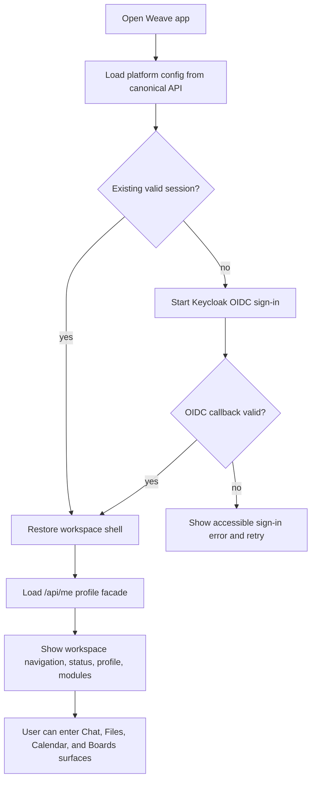
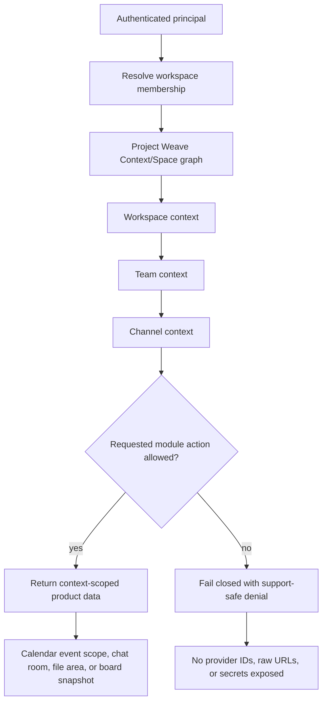
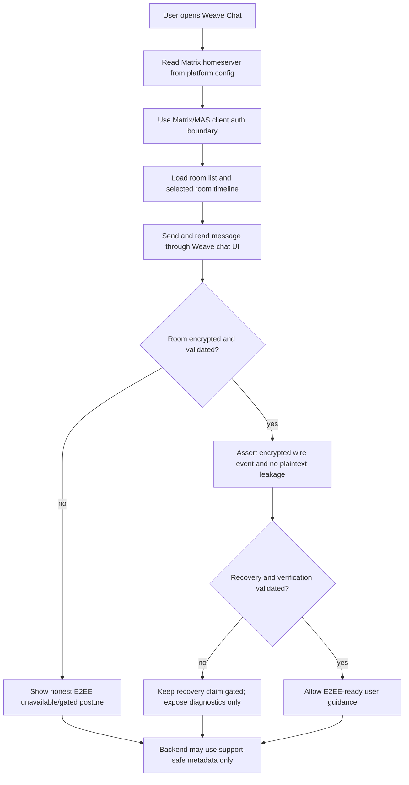
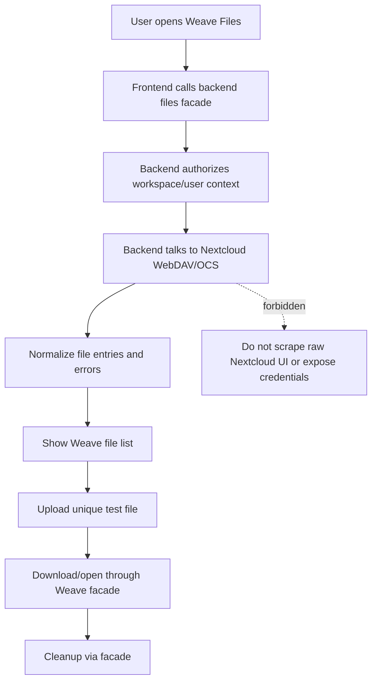
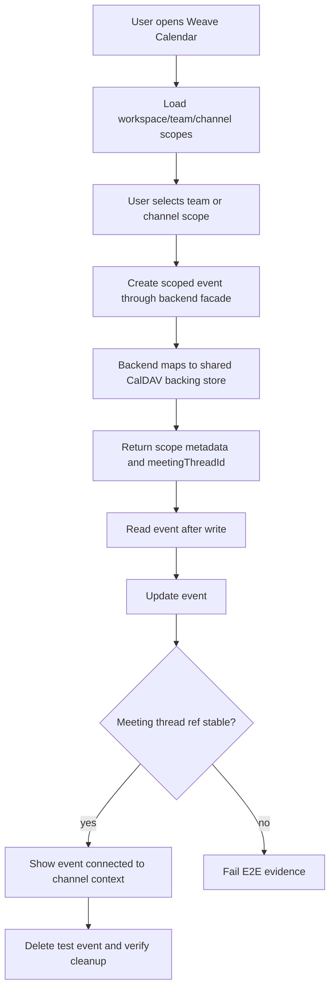
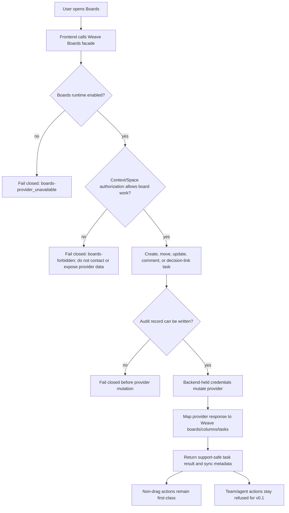
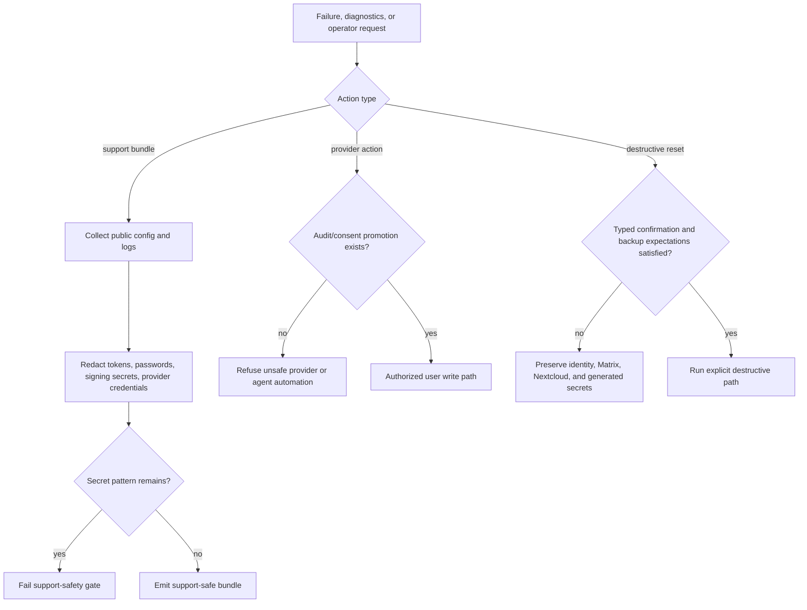

# Weave product-flow activity diagrams

These diagrams are presentation-ready product flows for the North-Star MVP evidence layer. They intentionally describe Weave-owned user journeys rather than raw Matrix, Nextcloud, OpenProject, or operator-internal workflows.

Executable scenario anchors:

- Frontend Live Stack: `e2e/features/live_stack_app.feature`
- Backend Cucumber: `server/src/test/resources/features/openproject-boards-workspace.feature`
- Infra Live Gates: `infra/weave-workspace/openproject-boards-live-e2e.sh`, operator checks, support-bundle redaction tests, and restore-smoke checks

Source/quality-check anchors:

- Identity/profile source of truth: `specs/03-identity-and-unified-user-profile.md:73` and `/api/me`.
- CI/smoke/E2E source of truth: `specs/10-ci-smoke-and-e2e-contract.md:59`.
- Spec-map guard source: `/tool/spec_map.dart` in the repository that owns the checked mapping.
- `/admin/protocol` is not a current Weave product route here; treat it only as shorthand for raw admin/protocol fallback surfaces unless a future spec defines the endpoint.
- `/storage/power` is not a current Weave product route here; treat it only as shorthand for the manual storage/power budget gate unless a future spec defines the endpoint.

## 1. Sign-in and workspace shell

Scenario anchor: `@weave-live-auth-shell`

## 2. Workspace, team, and channel context

Scenario anchors: `@weave-live-calendar-threadrefs`, `@backend-openproject-context-space-gate`, `@infra-openproject-context-gate`

## 3. Matrix chat and E2EE posture/recovery boundary

Scenario anchor: `@weave-live-matrix-e2ee`

## 4. Files product boundary

Scenario anchor: `@weave-live-files-boundary`

## 5. Calendar and meeting threads

Scenario anchor: `@weave-live-calendar-threadrefs`

## 6. Boards user writes, fail-closed provider boundary, and context gate

Scenario anchors: `@weave-v01-board-write-audit`, `@weave-live-boards-workspace-nondrag`, `@backend-openproject-disabled-fail-closed`, `@backend-openproject-context-space-gate`, `@infra-openproject-enabled-workspace`

## 7. Support, redaction, and refusal gates

Scenario anchors: `@backend-openproject-support-safe-metadata`, `@backend-openproject-write-refusals`, `@infra-support-bundle-redaction`, `@infra-reset-guardrails`

