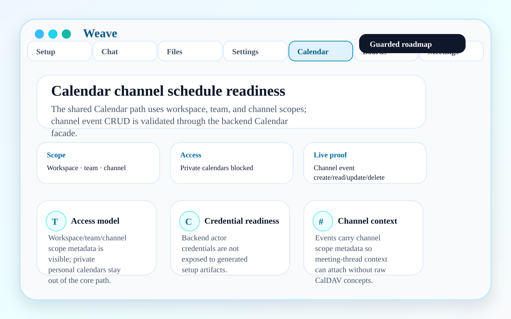
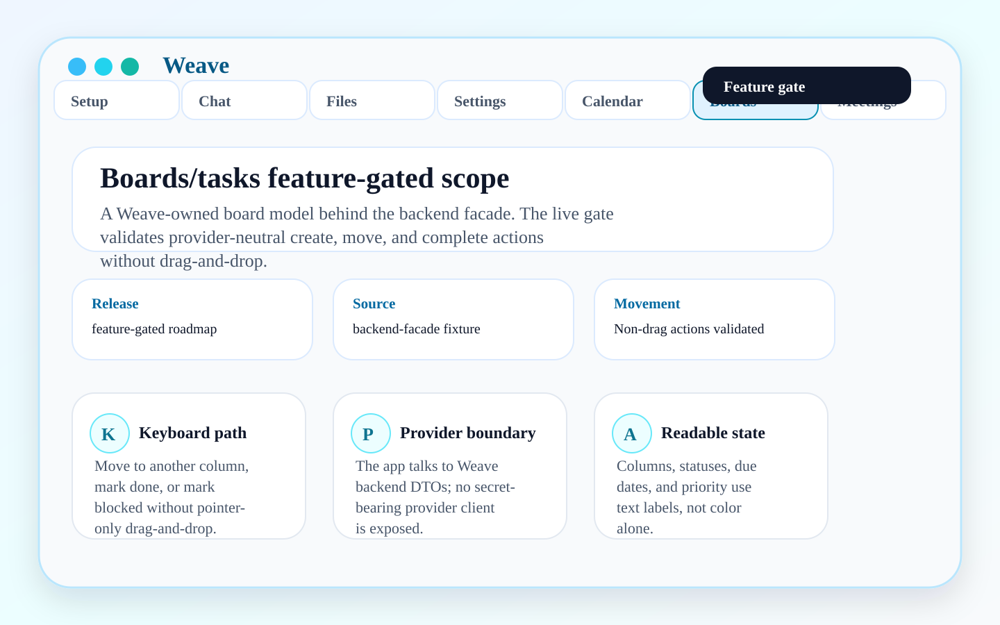
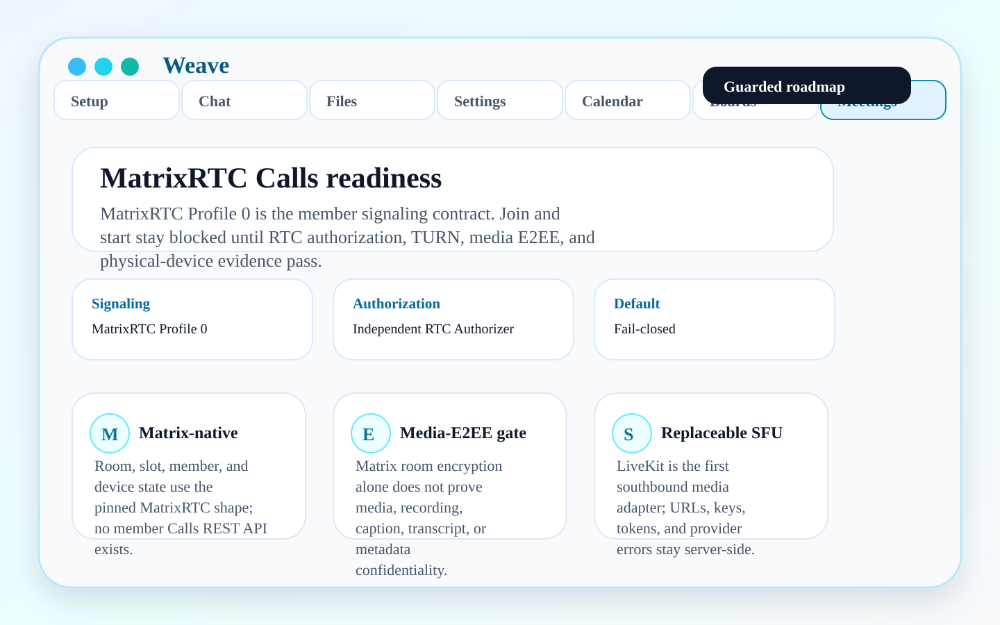

# Roadmap and guarded surfaces

The README showcase is limited to product surfaces that contributors can evaluate directly today: setup, service review, chat, files, readiness, and settings. This page keeps in-progress product areas visible without marketing them as fully shipped.

## Shared calendars

Calendar is active product scope, but it is not promoted as a finished everyday surface in the README showcase. The target product model is shared workspace, team, and channel scheduling backed by the Weave backend calendar facade and Nextcloud/CalDAV storage foundations. Private personal calendar ingestion is not a product goal for the current path.

Current evidence and boundaries:

- Shared scope metadata and channel event create/read/update/delete are live-stack contract scope.
- Meeting-thread attachment is follow-up work.
- Raw Nextcloud Calendar is not the normal product UX.
- Backend actor credentials must not leak into generated setup artifacts, app config, logs, or support bundles.

## Boards/tasks

Boards/tasks are active Weave scope behind feature gates and provider-neutral backend contracts. The current product language must not claim a live Vikunja, Deck, OpenProject, or other provider integration unless that provider path is configured and validated.

Current evidence and boundaries:

- Flutter may render provider-neutral board/task DTOs and accessible non-drag actions.
- OpenProject is the preferred workspace provider validation path, not the visible product UX.
- Vikunja and Deck remain comparison/fallback research unless a later contract promotes them.
- Provider auth, pagination, sync, webhook validation, export/import, and error translation belong behind backend or connector adapters.
- Any provider-specific claim must be tied to a validated runtime and documented capability boundary.

## Meetings / video calls

Calls and meetings are active product scope. Matrix v1.19 plus pinned MatrixRTC Profile 0 is the only member signaling contract. An internal RTC Authorizer must independently validate current room, slot/member, device, role, policy, nonce, audience, and expiry before a short-lived SFU token is issued. LiveKit is only the first replaceable southbound SFU adapter. Matrix room encryption must not be presented as covering media, captions, transcripts, recordings, or metadata.

Current evidence and boundaries:

- Provider status may report LiveKit SFU configuration readiness, but never treats it as the member signaling or authorization contract.
- Flutter must not hold LiveKit API keys, API secrets, room tokens, or credential-bearing join URLs.
- Support and readiness output may expose booleans such as configured/enabled only, not raw LiveKit URLs, token endpoints, raw provider errors, or secrets.
- RTC Authorizer, TURN, media E2EE, recording, transcription, captions, metadata retention, interoperability, and physical-device claims require explicit evidence before promotion.

## Matrix E2EE

Matrix E2EE is implemented as a client-owned Rust release candidate, not yet a completed product claim. Weave must not claim chat is end-to-end encrypted until live encrypted-room behavior, device verification, key backup/recovery, lost-device handling, multi-device behavior, metadata boundaries, accessible verification/recovery UX, and physical-iPhone relaunch continuity are validated.

## Provider stack readiness

Provider stack readiness belongs in Workspace Health as the admin/operator control plane. Owners/admins/operators can inspect whether files, calendar, office, DevOps, boards, identity, meetings, and other modules are available, disabled by policy, not configured, degraded, unavailable, or intentionally unsupported before inviting normal members. Normal members must not see provider setup diagnostics; they see available product workflows or simple impact/fallback states only.

The app must keep this support-safe:

- no raw provider URLs;
- no bearer tokens, API tokens, app passwords, cookies, room tokens, or secrets;
- no raw downstream error bodies;
- no direct Flutter provider calls;
- retry paths must rebuild backend readiness through Weave APIs.

See [Admin-provisioned first use boundary](admin-provisioned-first-use.md) for the member vs admin/operator acceptance criteria.

## Related contracts

- [Product scope: calendar hierarchy, Matrix E2EE, and Boards](product-calendar-e2ee-boards-scope.md)
- [Admin-provisioned first use boundary](admin-provisioned-first-use.md)
- [Product acceptance flows](product-acceptance-flows.md)
- [Quality and acceptance evidence](quality-and-evidence.md)
