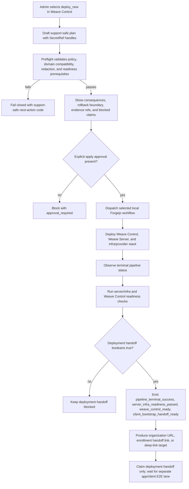
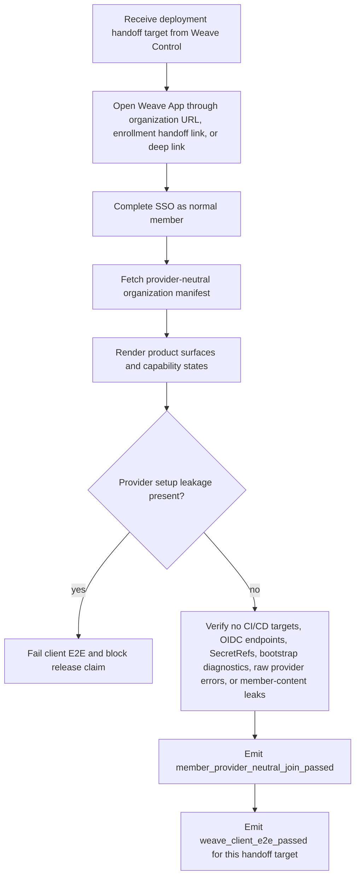

# Weave Control bootstrap-to-client contract

Status: Sprint 30 contract slice for issue #681, now subordinate to the stable [Bootstrap foundation](bootstrap-foundation-contract.md). This page turns the customer-simple setup direction into support-safe acceptance language; it does not authorize live provider mutation, production cutover, or a Weave Server rewrite.

## Product boundary

The Bootstrap foundation defines the enterprise component split: Control Plane = Weave Server + Admin Console; Provider Stack / Infra is optional and profile-driven; the member client is never deployed by bootstrap. Weave Control is the admin/operator bootstrap and operations product surface. It consists of `weavectl` plus the Control UI, backed by Weave Server as the Java domain facade, policy, readiness, audit, and evidence brain. It owns plan drafting, preflight, explicit apply approval, local/remote CI/CD dispatch, stack/bootstrap operations, rollback/support boundaries, readiness collection, support-bundle references, and client handoff target generation. Weave Server stays separately deployable or attachable until contract evidence proves a different implementation is safer.

The Admin Console is the organization management surface that sits on top of the same Weave Server contract after or during bootstrap. It owns organization/provider category management, IDM/RBAC sync, users/groups/roles, capability/RBAC profiles, policy preview, whitelists, audit views, readiness/diagnostics, and future governed Weaver category controls. It may show support-safe pipeline/evidence refs produced by Weave Control, but it must not become a raw CI log viewer or secret console.

Weave App is the member product surface. A normal member enters through an organization auth URL, non-secret enrollment handoff link, or deep link, completes SSO, and sees Weave product capabilities. The handoff link is not bearer access; account provisioning, organization/workspace membership, and the identity-provider session are the access control boundary. Members never configure CI/CD targets, Forgejo/GitHub/GitLab/Azure repositories, OIDC clients, provider URLs, service endpoints, SecretRefs, Matrix/Nextcloud/OpenProject/LiveKit internals, Weaver runtime internals, or bootstrap diagnostics.

| Surface | Primary responsibility | Must not own |
| --- | --- | --- |
| Weave Control | Bootstrap/ops plans, preflight, approved mutation dispatch, stack readiness, handoff target, support-safe deployment evidence. | Member UX, provider-specific member setup, app/client E2E signals, raw secrets, raw logs, or member content. |
| Admin Console | Organization/provider/policy management, readiness, IDM/RBAC, whitelists, audit, diagnostics, future Weaver governance controls. | CI/CD mutation without Weave Control approval boundary, raw provider payloads, raw runtime config, or member app flows. |
| Weave App / Client | SSO/invite/deep-link entry, provider-neutral product surfaces, member capability states, separate app/client E2E proof. | Provider setup, SecretRefs, endpoint rotation, bootstrap diagnostics, CI/CD targets, Admin Console policy authoring, or Weaver runtime administration. |

## Setup modes

| Mode | Admin/operator intent | Allowed mutation boundary | Member result | Evidence boundary |
| --- | --- | --- | --- | --- |
| `deploy_new` | Weave Control provisions a new provider/domain target from an approved plan. | Only resources named in the plan, after dry-run/preflight, consequence copy, rollback/support boundary, and explicit apply approval. | Organization manifest exposes provider-neutral states such as `available`, `disabled_by_policy`, `not_configured`, `degraded`, `unavailable`, or `coming_later`. | Plan ref, pipeline/run ref, readiness refs, audit refs, and redacted support bundle refs. |
| `attach_existing` | Weave Control binds an existing customer/provider domain without redeploying it. | No provider redeploy, destructive migration, or credential rotation unless a separate approved action says so. | Members see product capability states only; attach diagnostics remain admin/operator-only. | Attach preflight ref, SecretRef posture, health/readiness refs, and support-safe next-action codes. |
| `hybrid` | The organization mixes deploy-new and attach-existing by domain. | Each domain keeps its own mutation boundary; unsupported combinations fail closed before apply. | Members receive one coherent Weave manifest, not provider-specific setup prompts. | Per-domain mode refs plus aggregate member preview and release-claim boundary. |

Unsupported combinations must return stable support-safe next-action codes. They must not leak raw provider errors, credential-bearing URLs, tenant URLs, downstream payloads, tokens, or member content.

## Bootstrap-to-client state machine

The following activity diagram summarizes the deploy-new local Forgejo handoff lane. For screen readers: an admin drafts a support-safe plan, preflight validates it, explicit approval gates mutation, Forgejo dispatch runs the selected Weave Control/server/infra deployment, readiness checks emit deployment booleans, and client-bootstrap handoff is produced without claiming app/client E2E.

The separate app/client E2E lane consumes the handoff target. For screen readers: a client test receives the organization URL, enrollment handoff link, or deep link, opens Weave App, completes SSO as a normal member, loads the provider-neutral organization manifest and product surfaces, checks that provider setup details are absent, and only then emits member/client evidence signals. This lane is intentionally client-owned; the Forgejo deployment runner stays client-free and never emits member join or app E2E booleans.

1. `draft_plan` — owner/admin/operator selects domains and setup modes. Inputs are provider category choices, opaque `SecretRef`/`CredentialRef` handles, repo/pipeline target refs, policy profile refs, and rollback/support expectation. Raw secrets and credential-bearing URLs are rejected.
2. `preflight_ready` — Weave Server validates domain compatibility, policy posture, required SecretRefs, redaction posture, and member impact preview. No mutation has happened.
3. `awaiting_apply_approval` — Weave Control shows consequences, recovery boundary, support-safe evidence that will be emitted, and blocked claims. High-impact actions require an approval receipt.
4. `apply_dispatched` — after approval, `weavectl`/Control UI writes or dispatches only the selected plan target. `tools/weavectl bootstrap plan` reads the stable bootstrap profile fixture and rejects unsupported profile/target combinations before apply. `tools/weavectl bootstrap apply --plan <plan-ref>` is dry-run/validate-only by default; explicit `--dry-run` is equivalent, while mutation requires `--execute --approval-ref <approval-ref>`. Dogfood local shell dispatch may call the existing `infra/weave-workspace/install.sh` executor; remote provider lanes remain blocked until their adapters prove support-safe dispatch.
5. `pipeline_observed` — Admin Console and/or shell surfaces pipeline status through support-safe refs and terminal booleans, not raw logs.
6. `stack_readiness_observed` — Weave Server exposes per-domain readiness and policy state. Admins see next actions; members see only translated capability states.
7. `first_user_activation_ready` — owner/admin creates, activates, or invites the first users through Weave Control.
8. `member_client_ready` — invited members open Weave App, complete SSO, and enter product surfaces without provider/OIDC/endpoint setup.
9. `evidence_complete` — release claims may reference only the exact mode/domain scope whose pipeline, readiness, E2E, support-bundle, accessibility, and claim-control evidence is current.

## Inputs, outputs, and errors

Required plan fields:

- `plan_ref` and candidate commit SHA;
- organization and domain refs;
- setup mode per domain: `deploy_new`, `attach_existing`, or `hybrid` aggregate;
- selected provider category/adapters visible only to owner/admin/operator roles;
- required `SecretRef`/`CredentialRef` handles and missing-secret reason codes;
- mutation boundary and rollback/support expectation;
- member capability preview using provider-neutral states;
- evidence refs to be emitted: plan, pipeline, readiness, E2E, audit, support bundle, and claim gate.

Required terminal booleans for the local Forgejo deployment handoff are `pipeline_terminal_success`, `server_infra_readiness_passed`, `weave_control_ready`, and `client_bootstrap_handoff_ready`. They remain false/unknown until an approved local run deploys the selected Weave Control, server, and infra target and emits support-safe handoff evidence. Flutter/App E2E is a separate client lane: the Forgejo deployment runner must not install Flutter, Linux desktop dependencies, Xvfb/GTK, or app/client E2E harnesses, and must not emit `member_provider_neutral_join_passed` or `weave_client_e2e_passed` as deployment-lane results. A dispatched workflow, generated plan, or preflight-only proof is `dispatch_preflight_only` until all deployment handoff booleans are true for the selected target. The member handoff may claim `member_provider_neutral_join_passed` only when a normal member has joined through an organization URL, non-secret enrollment handoff link, or deep link and seen product surfaces without provider setup leakage; `weave_client_e2e_passed` may be true only when the separate app/client E2E lane has passed against that target.

Error responses must use stable codes such as `unsupported_hybrid_combination`, `missing_secretref`, `preflight_failed`, `approval_required`, `pipeline_not_terminal`, `readiness_degraded`, `e2e_not_proven`, `manual_at_missing`, or `claim_blocked`. Support-safe evidence may include opaque refs and reason codes only. The repo-local CLI guard exercises this surface through `tools/weavectl bootstrap plan` plus dry-run `tools/weavectl bootstrap apply` and rejects client-deployment or readiness overclaims.

## Member-provider boundary

The member path may contain:

- organization/non-secret enrollment handoff/deep-link entry;
- Weave SSO sign-in;
- member states `available`, `disabled_by_policy`, `not_configured`, `degraded`, `unavailable`, or `coming_later`;
- short impact/fallback copy such as “Calendar is unavailable; ask an admin.”

The member path must not contain provider setup forms, OIDC/SAML wiring, realms, CI/CD target selection, raw service endpoints, SecretRefs, selected adapter names in core workflows, provider diagnostics, raw downstream errors, tokens, tenant URLs, Matrix room IDs, Nextcloud paths, OpenProject/Vikunja project identifiers, LiveKit room tokens, or bootstrap run logs.

## Optional governed Weaver boundary

Weaver remains an optional future organization capability and governance surface, disabled by default. It belongs in Admin Console policy/readiness/whitelist planning so the organization story does not forget it, but this contract and WEAVE-SPEC-0001 do not claim Weaver/AI runtime behavior in v0.1. It is unavailable unless all of these are true:

1. organization policy enables the Weaver category;
2. per-user or group policy grants `weaver.enabled`;
3. the governed runtime generator and sandbox profile are enabled;
4. tool and domain allowlists intersect with the member's normal rights;
5. write-like or external actions require approval receipts;
6. audit, revoke, redaction, and support-safe evidence refs are active.

Policy-denied, approval-required, revoked, unavailable, and not-configured states must be observable to admins/operators and translated to safe member copy. Support evidence must exclude prompts, private memory, member content, tokens, raw provider payloads, credential URLs, raw runtime configuration, and raw downstream errors. No PR, release note, issue comment, or product copy may claim Weaver is a default production PA or broadly autonomous assistant from this slice.

## Current repo slices

- `docs/admin-provisioned-first-use.md` owns the member/admin first-use split.
- `docs/admin-suite-readiness-setup-contract.md` owns Admin Console readiness, guided setup, and claim-control summary language.
- `docs/control-plane-infra-bootstrap.md` owns current bootstrap artifacts, SecretRefs, and smoke contract.
- `docs/governed-weaver-runtime-security-contract.md` owns Weaver policy, runtime, sandbox, approval, audit, and revoke gates.
- `client/test/architecture/admin_provisioned_first_use_contract_test.dart` and `client/test/architecture/member_client_provider_boundary_contract_test.dart` guard member setup leakage.

## Release-claim boundary

This contract narrows #681 into a testable flow. It does not close #665 without operator-approved local Forgejo deployed-stack evidence, and it does not close #591 or claim manual assistive-technology pass without human evidence or an explicit scoped release-owner waiver.
