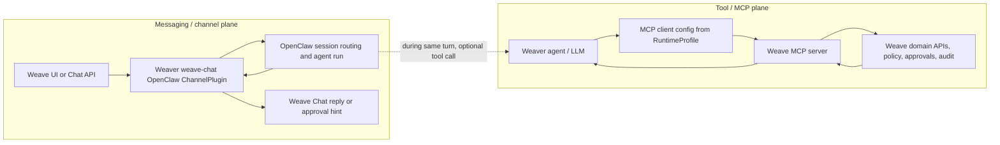

# Feature 0009: Domain-first MCP tools

Corpus sources: `WEAVE-STEERING-SPEC-KIT-OPERATING-MODEL`, provider portability principles, domain context map.

Weaver-facing MCP tools expose Weave domain capabilities, not provider adapters. Names, policies, audit receipts, approvals, and runtime profile grants use domain verbs and nouns (`calendar.search_events`, `files.share_item`, `chat.send_message`). Provider references remain support-safe evidence behind Weave server/domain facades.

This specification covers the tool/MCP plane only. It does not define the user-to-agent messaging channel. The Weave Chat channel is a separate OpenClaw channel plugin path implemented in Weaver as `weave-chat`; MCP `chat.send_message` is a domain tool an already-running agent may call after a turn starts, not the inbound user messaging transport.

## Channel plane vs MCP/tool plane

OpenClaw's message pipeline routes an inbound channel message through routing/session resolution, an agent run, and outbound channel replies. OpenClaw channel plugins own provider-specific configuration, security/pairing, session grammar, outbound delivery, reply threading, and approval capability presentation; OpenClaw core owns the shared `message` tool, prompt/session dispatch, and shared approval lifecycle. OpenClaw plugin docs distinguish `api.registerChannel(...)` for messaging channels from `api.registerTool(...)` for agent tools, and OpenClaw MCP docs distinguish `openclaw mcp serve` as an MCP bridge over existing OpenClaw-routed channel conversations from saved outbound MCP server definitions consumed by runtimes.

Weave/Weaver therefore use two separate planes that may interact during one agent turn but must not be collapsed:

Screen-reader description: the messaging plane starts with a member message in Weave Chat, enters Weaver through the `weave-chat` OpenClaw channel plugin, runs an OpenClaw session/agent turn, and returns replies or approval hints through the same channel. The tool plane starts inside the Weaver agent/LLM after a turn has begun, uses MCP client configuration from the signed RuntimeProfile, calls the Weave MCP server, and receives domain-tool results from Weave APIs guarded by policy and audit. The dotted connection means one agent turn can use both planes, not that they are the same transport.

### Weave-owned responsibilities

- Product domains, UI/API, spaces/channels/threads, RBAC/policy, approval policy, audit semantics, runtime profile generation, and MCP server/domain tools.
- The `weave-chat` product API surface and support-safe runtime-token/Profile metadata.
- Tool allow/deny policy and profiles as policy inputs distinct from channel transport.
- No implementation of the OpenClaw channel plugin runtime in the Weave product repo.

### Weaver-owned responsibilities

- The OpenClaw-derived harness, `weave-chat` channel plugin implementation, session routing, inbound/outbound messaging through Weave Chat, and approval hint rendering from the OpenClaw approval lifecycle.
- MCP client binding to Weave MCP server definitions generated from the signed RuntimeProfile.
- Enforcement that custom MCP servers and OpenClaw plugin/core-tool MCP bridges remain explicit/default-off and separate from channel transport.

### Non-goals

- Do not implement user-to-agent messaging through MCP `chat.send_message` or any MCP conversation bridge.
- Do not expose raw provider channels, raw provider tools, secrets, or OpenClaw dashboard/config surfaces to normal members.
- Do not claim release/customer readiness while the manual assistive-technology release blocker (`#762`) remains open.

## Spike plan

1. **Weaver `weave-chat` ChannelPlugin spike** (`masssi164/weaver#20`): implement and validate the OpenClaw channel plugin SDK contract for inbound Weave Chat events, session grammar, outbound replies, threading, and approval hints. MCP is out of scope except for tools an agent might call after the channel starts a turn.
2. **Weave MCP server spike** (`#764`): implement and validate the Weave domain-tool server exposed to Weaver through RuntimeProfile/custom MCP server config. It has no user messaging semantics.
3. **Separated E2E proof spike** (`#765`): prove a user message through `weave-chat` triggers a Weaver reply, and optionally prove a same-turn Weave MCP tool call with approval/policy/audit. Tests must assert channel roundtrip and MCP tool execution as separate evidence.

## Acceptance

- Tool taxonomy is organized by Weave domains.
- Adapter/provider terms are hidden from user-facing tool names and policy grants.
- Provider evidence may be captured only as redacted `ProviderRef`/capability evidence behind the facade.

## MCP implementation acceptance

This spec owns only the tool/MCP plane:

- Publish a Weave MCP server manifest with domain-first tools, discovery metadata, support-safe schemas, and no user-message transport semantics.
- Implement tool invocation through Weave domain APIs with policy checks, CredentialRef resolution, ApprovalReceipt requirements, support-safe result shaping, and audit events.
- Project the server to Weaver through `mcp.servers.weave-domain-tools` in the signed RuntimeProfile, separate from `channels.weave-chat`.
- Tests must cover MCP discovery, invoke success, policy denial, approval receipt validation, audit emission, CredentialRef redaction, and absence of channel-plugin behavior.

Non-goals: no `weave-chat` ChannelPlugin implementation, no inbound user-to-agent messaging over MCP, no provider-native tool exposure, and no release/customer-ready claim while #762 remains open.
